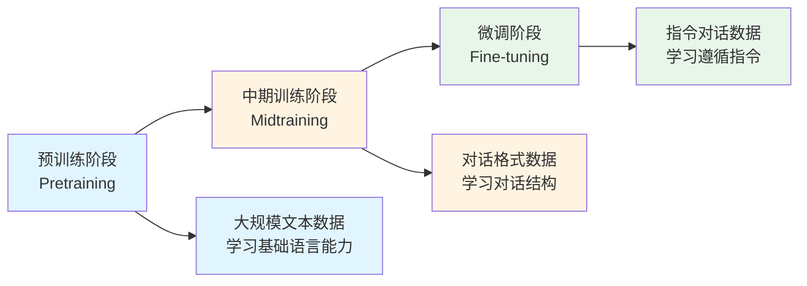
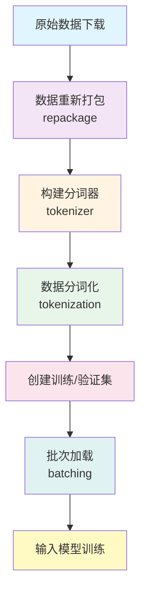
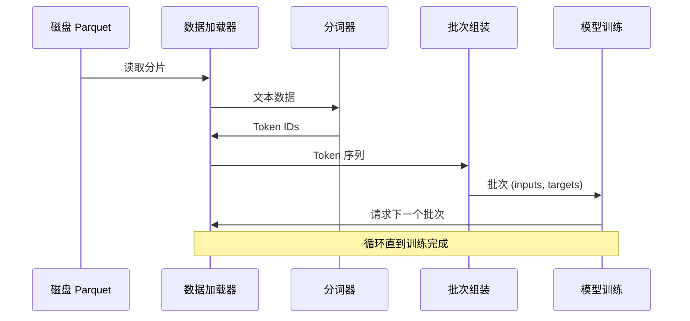
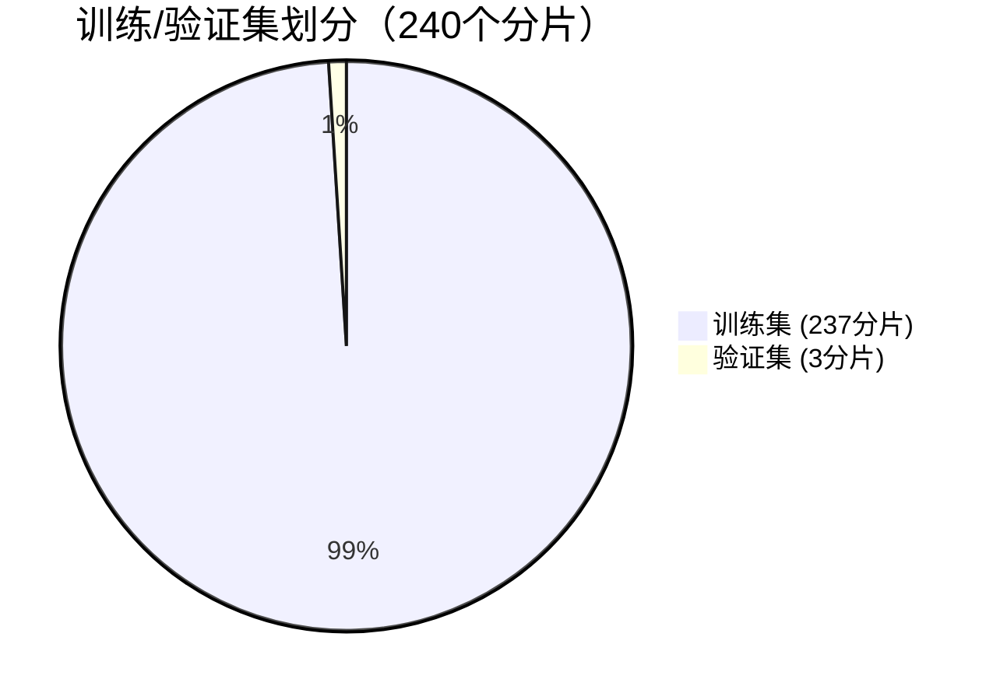
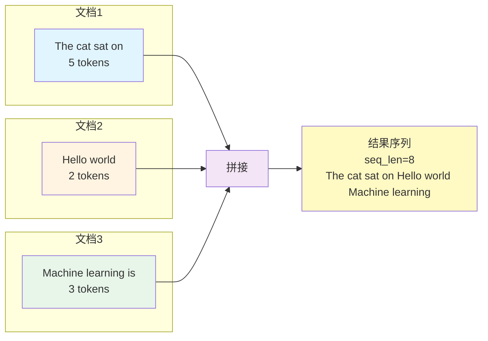
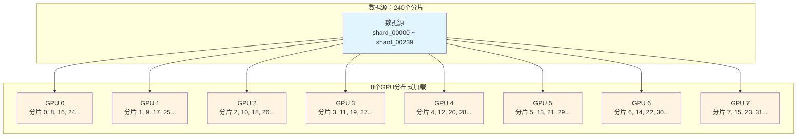
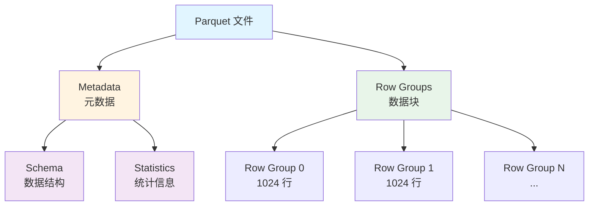

# nanochat 数据处理完全指南

> 本文档详细介绍 nanochat 项目的数据处理流程，适合初学者阅读。


## 数据源说明

本项目针对不同地区用户提供了优化的数据访问方案：

### 国内版（推荐）
- **预训练数据**：使用 ModelScope 平台的 [FineWeb-Edu 数据集（ModelScope）](https://modelscope.cn/datasets/Datawhale/fineweb-edu-100b-shuffle)
- **优势**：国内访问速度快、稳定性高、无需特殊网络配置
- **配置**：项目已默认使用国内源，无需额外设置

### 国际版
- **预训练数据**：使用 HuggingFace 原始数据集 [FineWeb-Edu 原始数据集](https://huggingface.co/datasets/HuggingFaceFW/fineweb-edu)
- **适用**：海外用户或需要访问原始数据源
- **配置**：需要修改 `nanochat/dataset.py` 中的数据源配置

## 目录

1. [数据处理概览](#数据处理概览)
2. [数据类型与来源](#数据类型与来源)
3. [数据处理流程](#数据处理流程)
4. [详细操作步骤](#详细操作步骤)
5. [数据处理技术细节](#数据处理技术细节)
6. [数据检查工具集](#数据检查工具集)
7. [数据格式说明](#数据格式说明)
8. [数据量计算](#数据量计算)
9. [常见问题解答](#常见问题解答)

---

## 数据处理概览

nanochat 项目训练一个完整的 ChatGPT 风格的语言模型，需要经历**三个主要阶段**，每个阶段使用不同的数据：



### 为什么需要三个阶段？

- **预训练**：让模型学习语言的基本规律（语法、常识、推理等）
- **中期训练**：让模型学会对话的格式和结构
- **微调**：让模型学会更好地理解和执行用户指令

---

## 数据类型与来源

### 1. 预训练数据（Base Training Data）

**数据来源**：FineWeb-Edu 数据集

#### 国内版（默认，推荐）

- **数据集**：`Datawhale/fineweb-edu-100b-shuffle`
- **平台**：ModelScope（魔搭社区）
- **访问地址**：https://modelscope.cn/datasets/Datawhale/fineweb-edu-100b-shuffle
- **数据规模**：约 100B（1000 亿）个 GPT-2 tokens
- **数据内容**：高质量的网页文本数据，已经过混洗处理
- **数据格式**：Parquet 文件（压缩后的表格格式）
- **优势**：
  - 国内访问速度快
  - 下载稳定可靠
  - 无需特殊网络配置
  - 项目已默认配置

#### 国际版（备选）

- **数据集**：`HuggingFaceFW/fineweb-edu`
- **平台**：HuggingFace
- **访问地址**：https://huggingface.co/datasets/HuggingFaceFW/fineweb-edu
- **说明**：原始数据源，海外用户可直接访问
- **切换方法**：修改 `nanochat/dataset.py` 中的数据源配置

**数据特点**：

- 每个数据分片（shard）约 250M 字符
- 压缩后每个文件约 100MB
- 使用 zstd 压缩算法
- 总共约 1822 个分片

**下载方式**：

```bash
# 下载 8 个分片用于训练分词器（约 800MB）
python -m nanochat.dataset -n 8

# 下载 240 个分片用于预训练（约 24GB）
python -m nanochat.dataset -n 240
```

### 2. 中期训练数据（Midtraining Data）

**数据来源**：SmolTalk 对话数据集

#### 数据源信息

- **数据集**：`HuggingFaceTB/smoltalk`
- **平台**：HuggingFace
- **数据内容**：真实的多轮对话数据
- **数据格式**：对话消息列表
- **下载方式**：训练脚本自动下载

#### 国内访问优化

如果下载速度慢，可以设置 HuggingFace 镜像：

```bash
export HF_ENDPOINT=https://hf-mirror.com
```

**数据结构示例**：

```json
{
  "messages": [
    { "role": "user", "content": "你好，请介绍一下自己" },
    { "role": "assistant", "content": "你好！我是一个AI助手..." }
  ]
}
```

### 3. 微调数据（SFT Data）

**数据来源**：多个任务数据集的混合

#### 数据集列表

- **ARC-Easy**：简单的选择题（2.3K 条）
- **ARC-Challenge**：困难的选择题（1.1K 条）
- **GSM8K**：数学推理题（8K 条）
- **SmolTalk**：对话数据（10K 条）

**总计**：约 21.4K 条训练样本

#### 国内访问优化

所有微调数据集来自 HuggingFace，会在训练时自动下载。国内用户建议设置镜像：

```bash
export HF_ENDPOINT=https://hf-mirror.com
```

或在 Python 代码中设置：

```python
import os
os.environ['HF_ENDPOINT'] = 'https://hf-mirror.com'
```

---

## 数据处理流程

### 流程图



### 详细说明

#### 步骤 1: 数据下载与重新打包

**目的**：使用已经处理好的、适合流式加载的数据集

**数据集特点**：

1. **已完成的预处理**

   - 数据已经过混洗（shuffle）处理，避免数据分布偏差
   - 已按照 250M 字符/分片进行打包
   - 使用 Parquet 格式存储（Row group size = 1024）
   - 已使用 zstd 压缩（level 3）

2. **数据集来源**

   - 原始数据：`HuggingFaceFW/fineweb-edu`（sample-100BT）
   - 处理后上传：`Datawhale/fineweb-edu-100b-shuffle`（ModelScope）
   - **优势**：国内用户可以直接从 ModelScope 快速下载，无需自己重新打包

3. **下载方式**

   ```bash
   # 项目已自动配置为从 ModelScope 下载
   python -m nanochat.dataset -n 8
   ```

#### 步骤 2: 训练分词器

**目的**：将文本转换为模型可以处理的数字序列

**过程**（参考 `scripts/tok_train.py`）：

1. **准备训练数据**

   ```python
   # 使用前 2B（20亿）字符训练分词器
   python -m scripts.tok_train --max_chars=2000000000
   ```

2. **训练 BPE 分词器**

   - 使用 Rust 实现的高效 BPE（Byte Pair Encoding）
   - 词汇表大小：65,536（2^16）
   - 训练过程：学习最常见的字符组合

3. **保存分词器**
   - 保存位置：`~/.cache/nanochat/tokenizer/`
   - 包含词汇表和合并规则

**什么是分词器？**

分词器就像一个"翻译官"，把人类的文字转换成模型能理解的数字：


#### 步骤 3: 数据分词化与加载

**目的**：将文本转换为 token 序列，并按需加载

**特点**：

- **即时分词**（On-the-fly tokenization）
- **流式加载**：不需要将所有数据预先分词
- **分布式支持**：多 GPU 自动划分数据

**数据加载器工作原理**：



**代码实现**：

```python
# 伪代码示例
def tokenizing_distributed_data_loader(batch_size, seq_len, split):
    """
    batch_size: 每个GPU的批次大小
    seq_len: 序列长度（上下文窗口）
    split: "train" 或 "val"
    """
    while True:
        # 1. 从磁盘读取一个 parquet 分片
        shard = load_next_shard()

        # 2. 遍历分片中的文档
        for doc in shard:
            text = doc['text']

            # 3. 使用分词器转换文本
            tokens = tokenizer.encode(text)

            # 4. 切分成固定长度的序列
            for i in range(0, len(tokens) - seq_len, seq_len):
                inputs = tokens[i:i+seq_len]
                targets = tokens[i+1:i+seq_len+1]  # 目标是输入向右偏移1位

                # 5. 组装成批次
                batch_inputs.append(inputs)
                batch_targets.append(targets)

                if len(batch_inputs) == batch_size:
                    yield (batch_inputs, batch_targets)
                    batch_inputs = []
                    batch_targets = []
```

**为什么使用这种方式？**

- 节省磁盘空间（不需要预先分词并保存）
- 节省内存（流式加载，只保留当前需要的数据）
- 灵活性高（可以随时更换分词器）

---

## 详细操作步骤

### 场景 1：运行默认的预训练（英文）

**前提条件**：

- 8 张 H100 或 A100 GPU
- 足够的磁盘空间（约 30GB）

**步骤**：

```bash
# 1. 下载初始数据（用于训练分词器）
python -m nanochat.dataset -n 8

# 2. 后台下载完整训练数据
python -m nanochat.dataset -n 240 &

# 3. 训练分词器
python -m scripts.tok_train --max_chars=2000000000

# 4. 评估分词器
python -m scripts.tok_eval

# 5. 开始预训练
torchrun --standalone --nproc_per_node=8 -m scripts.base_train --depth=20

# 6. 评估模型
torchrun --standalone --nproc_per_node=8 -m scripts.base_eval
```

**或者直接运行一键脚本**：

```bash
bash speedrun.sh
```

### 场景 2：训练中文模型

**步骤 1：准备中文数据**

创建数据下载脚本：

```python
# download_chinese_data.py
from datasets import load_dataset, concatenate_datasets
import os

print("下载中文数据集...")

# 1. 中文维基百科
wiki = load_dataset("wikipedia", "20220301.zh", split="train[:100000]")
print(f"维基百科: {len(wiki)} 条")

# 2. 百度百科
baike = load_dataset("xusenlin/baidubaike-563w", split="train[:200000]")
print(f"百度百科: {len(baike)} 条")

# 3. 新闻数据
news = load_dataset("THUDM/LongBench", "news", split="train[:50000]")
print(f"新闻数据: {len(news)} 条")

# 合并数据集
combined = concatenate_datasets([wiki, baike, news])

# 数据清洗
import re

def clean_text(example):
    text = example.get('text', example.get('content', ''))
    # 去除特殊字符，只保留中文、英文、数字和标点
    text = re.sub(r'[^\u4e00-\u9fa5a-zA-Z0-9，。！？、；：""''（）【】《》\s]', '', text)
    if len(text) < 50:  # 过滤太短的文本
        return None
    return {'text': text}

combined = combined.map(clean_text)
combined = combined.filter(lambda x: x is not None)

print(f"\n清洗后数据量: {len(combined)} 条")

# 保存为 parquet 格式
output_dir = os.path.expanduser("~/.cache/nanochat/chinese_data")
os.makedirs(output_dir, exist_ok=True)

# 分割成多个分片（每个约 10 万条）
shard_size = 100000
num_shards = (len(combined) + shard_size - 1) // shard_size

for i in range(num_shards):
    start = i * shard_size
    end = min(start + shard_size, len(combined))
    shard = combined.select(range(start, end))

    shard_path = f"{output_dir}/shard_{i:05d}.parquet"
    shard.to_parquet(shard_path, compression='zstd', compression_level=3)

    print(f"已保存 {shard_path}: {len(shard)} 条")

print("\n中文数据准备完成！")
```

运行：

```bash
python download_chinese_data.py
```

**验证中文数据质量**：

```bash
# 1. 检查数据完整性
python -m data_check.check_data ~/.cache/nanochat/chinese_data

# 2. 检查字符分布（验证中文比例）
python -m data_check.check_char_distribution ~/.cache/nanochat/chinese_data/shard_00000.parquet

# 3. 检查文本长度分布
python -m data_check.check_length_distribution ~/.cache/nanochat/chinese_data/shard_00000.parquet

# 4. 抽样检查内容质量
python -m data_check.check_content_quality ~/.cache/nanochat/chinese_data/shard_00000.parquet 20
```

**步骤 2：训练中文分词器**

中文分词器需要更大的词汇表（因为中文字符更多）：

```bash
# 修改 tok_train.py 中的 vocab_size 参数
python -m scripts.tok_train --max_chars=2000000000 --vocab_size=80000
```

**步骤 3：修改训练配置**

使用 `configs/chinese_d20.yaml` 配置文件，或手动指定参数：

```bash
torchrun --standalone --nproc_per_node=8 -m scripts.base_train \
    --depth=20 \
    --vocab_size=80000 \
    --device_batch_size=16  # 中文模型可能需要调整批次大小
```

**完整流程可参考**：`scripts/train_chinese.sh`

### 场景 3：准备自定义对话数据（微调）

**数据格式要求**：

每条数据是一个包含多轮对话的 JSON 对象：

```json
{
  "messages": [
    {
      "role": "user",
      "content": "如何做番茄炒蛋？"
    },
    {
      "role": "assistant",
      "content": "做番茄炒蛋的步骤如下：\n1. 准备材料：鸡蛋3个，番茄2个...\n2. 将鸡蛋打散..."
    },
    {
      "role": "user",
      "content": "需要放糖吗？"
    },
    {
      "role": "assistant",
      "content": "可以放一点点糖，能让番茄的酸味更柔和..."
    }
  ]
}
```

**准备数据步骤**：

1. **下载或准备数据集**

例如，使用 Belle 中文对话数据集：

```python
from datasets import load_dataset

# 下载 Belle 数据集
belle = load_dataset("BelleGroup/train_1M_CN", split="train[:100000]")

# 转换为对话格式
def convert_format(example):
    instruction = example['instruction']
    input_text = example.get('input', '')
    output = example['output']

    if input_text:
        user_content = f"{instruction}\n\n{input_text}"
    else:
        user_content = instruction

    return {
        "messages": [
            {"role": "user", "content": user_content},
            {"role": "assistant", "content": output}
        ]
    }

converted = belle.map(convert_format)

# 保存为 JSONL 格式
output_dir = os.path.expanduser("~/.cache/nanochat/chinese_sft")
os.makedirs(output_dir, exist_ok=True)
converted.to_json(f"{output_dir}/belle_100k.jsonl")
```

2. **使用自定义任务类加载数据**

参考 `tasks/smoltalk.py` 创建自定义数据加载器：

```python
# tasks/my_chinese_chat.py
from tasks.common import Task

class MyChineseChat(Task):
    def __init__(self, split, stop=None):
        from datasets import load_dataset
        # 从本地 JSONL 文件加载
        data_path = "~/.cache/nanochat/chinese_sft/belle_100k.jsonl"
        ds = load_dataset("json", data_files=data_path, split="train")

        # 分割训练/验证集
        ds = ds.train_test_split(test_size=0.1, seed=42)
        self.data = ds[split]

        if stop is not None:
            self.data = self.data.select(range(min(stop, len(self.data))))

    def __len__(self):
        return len(self.data)

    def __getitem__(self, idx):
        return self.data[idx]
```

3. **在训练脚本中使用**

修改 `scripts/chat_sft.py`：

```python
from tasks.my_chinese_chat import MyChineseChat

train_ds = TaskMixture([
    MyChineseChat(split="train", stop=10_000),
    # 可以混合其他任务...
])
```

---

## 数据处理技术细节

### 1. 数据分片策略

**为什么要分片？**

- 便于分布式下载和加载
- 支持断点续传
- 可以并行处理

**分片大小的选择**：

- 每个分片 250M 字符 ≈ 100MB 压缩文件
- 不会太大（加载快）
- 不会太小（文件数量合理）

### 2. 训练/验证集划分

**默认比例**：99% 训练，1% 验证



**实现方式**：

```python
# 伪代码
total_shards = 240
train_shards = int(total_shards * 0.99)  # 237
val_shards = total_shards - train_shards  # 3

if split == "train":
    shard_indices = range(0, train_shards)
else:  # "val"
    shard_indices = range(train_shards, total_shards)
```

**为什么验证集这么小？**

- 预训练数据规模巨大，1% 已经足够
- 节省计算资源
- 主要用于监控过拟合

### 3. 序列打包（Sequence Packing）

**问题**：文档长度不一，如何高效利用？

**解决方案**：连续拼接



**示例**：
```
文档1: "The cat sat on"        (5 tokens)
文档2: "Hello world"            (2 tokens)
文档3: "Machine learning is"    (3 tokens)

拼接后（假设 seq_len=8）:
["The", "cat", "sat", "on", "Hello", "world", "Machine", "learning"]
```

**优点**：

- 最大化 GPU 利用率
- 不浪费计算资源
- 简单高效

**注意事项**：

- 文档之间没有特殊分隔符
- 模型会学习到文档边界（隐式）

### 4. 数据混洗（Shuffling）

**为什么要混洗？**

- 避免模型学到数据的顺序偏差
- 提高泛化能力

**两级混洗**：

1. **分片级别**：打乱分片顺序
2. **文档级别**：打乱每个分片内的文档顺序

### 5. 分布式数据加载

**多 GPU 场景**：



**代码实现**：

```python
# GPU 0 加载分片 0, 8, 16, 24...
# GPU 1 加载分片 1, 9, 17, 25...
# GPU 2 加载分片 2, 10, 18, 26...
# ...

shard_idx = (global_shard_count + ddp_rank) % total_shards
```

**好处**：

- 每个 GPU 读取不同数据
- 避免重复计算
- 自动负载均衡

---

## 数据检查工具集

项目提供了完整的数据检查和处理工具集（位于 `data_check/` 目录），帮助您验证数据质量、分析数据特征，并转换自定义数据。

### 工具概览

| 工具 | 功能 | 适用场景 |
| ---- | ---- | -------- |
| `check_data` | 检查 Parquet 文件完整性 | 验证数据下载是否完整、检测损坏文件 |
| `check_length_distribution` | 分析文本长度分布 | 评估数据长度分布，识别过短或过长文本 |
| `check_content_quality` | 随机抽样检查内容质量 | 手动检查样本质量，自动检测重复和乱码 |
| `check_char_distribution` | 统计字符分布 | 分析中英文比例，评估数据语言组成 |
| `convert_custom_data` | 转换自定义文本数据 | 将文本文件转换为标准 Parquet 格式 |

### 1. 数据完整性检查 (`check_data`)

**作用**：验证 Parquet 数据文件的完整性，检测损坏或空文件

**用法**：

```bash
# 检查默认数据目录
python -m data_check.check_data

# 检查指定目录
python -m data_check.check_data ~/.cache/nanochat/base_data

# 检查自定义数据目录
python -m data_check.check_data ~/.cache/nanochat/my_data
```

**输出示例**：

```
============================================================
数据完整性检查工具
============================================================

找到 240 个 Parquet 文件
位置: ~/.cache/nanochat/base_data

============================================================
检查进度:
============================================================
[  1/240] shard_00000.parquet:  12,345 条数据
[  2/240] shard_00001.parquet:  12,356 条数据
...
[240/240] shard_00239.parquet:  12,389 条数据

============================================================
检查结果:
============================================================

所有文件完整!

统计信息:
  文件数量: 240
  总数据量: 2,967,840 条
  平均每文件: 12,366 条
```

**使用场景**：
- 数据下载后验证完整性
- 训练前检查数据文件
- 检测数据损坏问题

### 2. 文本长度分布检查 (`check_length_distribution`)

**作用**：分析文本长度分布，识别过短或过长的文本，评估数据质量

**用法**：

```bash
# 检查单个文件
python -m data_check.check_length_distribution ~/.cache/nanochat/base_data/shard_00000.parquet

# 检查自定义数据
python -m data_check.check_length_distribution ~/.cache/nanochat/my_data/shard_00000.parquet
```

**输出示例**：

```
正在分析: ~/.cache/nanochat/base_data/shard_00000.parquet

长度统计:
  总样本数: 12,345
  平均长度: 1,234 字符
  最短: 156 字符
  最长: 8,932 字符

长度分布:
      < 50 字符: █ 2.3% (284)
   50-100 字符: ██ 5.1% (629)
  100-500 字符: ████████████████████ 45.2% (5,579)
 500-1000 字符: ████████████████ 32.1% (3,963)
1000-2000 字符: ████████ 12.5% (1,543)
2000-5000 字符: ███ 2.6% (321)
   > 5000 字符: █ 0.2% (25)

数据质量评估:
平均长度合理 (500-2000 字符)
超短文本比例正常
超长文本比例正常
```

**使用场景**：
- 评估数据长度分布是否合理
- 识别需要过滤的过短或过长文本
- 优化数据清洗策略

### 3. 内容质量抽样检查 (`check_content_quality`)

**作用**：随机抽取样本进行内容质量检查，自动检测重复文本和乱码

**用法**：

```bash
# 默认抽样 10 条
python -m data_check.check_content_quality ~/.cache/nanochat/base_data/shard_00000.parquet

# 指定抽样数量
python -m data_check.check_content_quality ~/.cache/nanochat/base_data/shard_00000.parquet 20
```

**输出示例**：

```
正在从 ~/.cache/nanochat/base_data/shard_00000.parquet 抽样...

============================================================
随机抽样检查 (共 10 条)
============================================================

────────────────────────────────────────────────────────────
样本 1/10
────────────────────────────────────────────────────────────
长度: 1,234 字符

The quick brown fox jumps over the lazy dog...

============================================================
内容质量检查清单:
============================================================

请手动检查以上样本,确认:
  句子完整,语法正确
  没有大量乱码
  没有大量重复内容
  内容有意义,信息量足够

自动检测结果:

无完全重复的文本
无极短文本
无明显乱码
```

**使用场景**：
- 手动检查数据内容质量
- 发现数据中的异常模式
- 验证数据清洗效果

### 4. 字符分布检查 (`check_char_distribution`)

**作用**：统计中英文、数字、标点等字符的分布比例，评估数据语言组成（特别适用于中文数据）

**用法**：

```bash
# 检查字符分布
python -m data_check.check_char_distribution ~/.cache/nanochat/base_data/shard_00000.parquet

# 检查中文数据
python -m data_check.check_char_distribution ~/.cache/nanochat/chinese_data/shard_00000.parquet
```

**输出示例**：

```
正在分析: ~/.cache/nanochat/chinese_data/shard_00000.parquet

============================================================
字符分布统计
============================================================

总字符数: 1,234,567

中文字符: ████████████████████████████████████████ 78.5% (968,635)
英文字符: ████ 6.2% (76,543)
    数字: █ 1.8% (22,222)
空白字符: ████ 8.1% (99,999)
标点符号: ████ 4.2% (51,852)
其他字符: █ 1.2% (14,816)

============================================================
数据质量评估 (针对中文数据)
============================================================

中文字符比例正常 (70-90%)
英文字符比例正常 (5-20%)
数字比例正常 (1-5%)

============================================================
最常见的20个字符
============================================================

 1.   '的' :   45,678 (3.70%)
 2.   '是' :   23,456 (1.90%)
 3.   ' ' :   18,765 (1.52%)
...
```

**使用场景**：
- 评估中文数据的语言组成
- 检查数据是否符合预期语言比例
- 识别数据中的异常字符

### 5. 自定义数据转换 (`convert_custom_data`)

**作用**：将文本文件转换为标准 Parquet 格式，方便用于训练

**用法**：

1. **编辑配置文件**：修改 `data_check/convert_custom_data.py` 中的参数：

```python
# 方法1: 从单个文件读取
input_file = "my_data.txt"

# 方法2: 从目录读取多个文件
input_dir = "my_texts"

# 输出目录
output_dir = os.path.expanduser("~/.cache/nanochat/my_data")

# 最小文本长度（过滤过短文本）
min_length = 50

# 每个分片的文本数量
shard_size = 100
```

2. **运行转换**：

```bash
python -m data_check.convert_custom_data
```

**工具功能**：
- 自动过滤过短文本（默认 < 50 字符）
- 自动分割成多个分片
- 使用 zstd 压缩，优化存储
- 输出标准 Parquet 格式，可直接用于训练

**输出示例**：

```
============================================================
自定义数据转换工具
============================================================

从 my_texts 读取 1,234 条文本

  保存: ~/.cache/nanochat/my_data/shard_00000.parquet (100 条)
  保存: ~/.cache/nanochat/my_data/shard_00001.parquet (100 条)
  ...
  保存: ~/.cache/nanochat/my_data/shard_00012.parquet (34 条)

转换完成! 数据保存在: ~/.cache/nanochat/my_data
```

**使用场景**：
- 转换自定义文本数据为训练格式
- 批量处理多个文本文件
- 准备本地数据集

### 使用建议

**数据验证流程**：

```bash
# 1. 下载数据后，检查完整性
python -m data_check.check_data

# 2. 检查数据长度分布
python -m data_check.check_length_distribution ~/.cache/nanochat/base_data/shard_00000.parquet

# 3. 抽样检查内容质量
python -m data_check.check_content_quality ~/.cache/nanochat/base_data/shard_00000.parquet 20

# 4. 如果是中文数据，检查字符分布
python -m data_check.check_char_distribution ~/.cache/nanochat/base_data/shard_00000.parquet
```

**自定义数据处理流程**：

```bash
# 1. 转换自定义数据
python -m data_check.convert_custom_data

# 2. 验证转换后的数据
python -m data_check.check_data ~/.cache/nanochat/my_data

# 3. 检查数据质量
python -m data_check.check_length_distribution ~/.cache/nanochat/my_data/shard_00000.parquet
python -m data_check.check_content_quality ~/.cache/nanochat/my_data/shard_00000.parquet
```

---

## 数据格式说明

### Parquet 格式

**什么是 Parquet？**

- 一种列式存储格式
- 高效压缩（比 JSON 小很多）
- 支持快速查询

**文件结构**：



**读取方式**：

```python
import pyarrow.parquet as pq

# 读取整个文件
table = pq.read_table("shard_00000.parquet")
texts = table["text"].to_pylist()

# 只读取部分行（高效）
table = pq.read_table("shard_00000.parquet",
                      columns=["text"],
                      filters=[("row_id", ">=", 0), ("row_id", "<", 1000)])
```

### JSONL 格式（对话数据）

**什么是 JSONL？**

- JSON Lines：每行一个 JSON 对象
- 方便逐行读取
- 适合流式处理

**示例文件**：

```jsonl
{"messages": [{"role": "user", "content": "你好"}, {"role": "assistant", "content": "你好！"}]}
{"messages": [{"role": "user", "content": "天气怎么样？"}, {"role": "assistant", "content": "今天天气不错。"}]}
```

**读取方式**：

```python
import json

with open("data.jsonl", "r", encoding="utf-8") as f:
    for line in f:
        data = json.loads(line)
        print(data["messages"])
```

---

## 数据量计算

### 如何确定需要多少数据？

**Chinchilla 原则**：数据量 = 模型参数量 × 20

**计算示例**：

以默认的 d20 模型为例：

1. **模型参数量**：561M（5.61 亿）
2. **需要的 token 数**：561M × 20 = 11.2B（112 亿）
3. **需要的字符数**：
   - 假设压缩比：1 token ≈ 4.8 字符
   - 字符数 = 11.2B × 4.8 ≈ 54B（540 亿）
4. **需要的分片数**：
   - 每个分片 250M 字符
   - 分片数 = 54B / 250M ≈ 216
   - **实际下载 240 个分片**（留有余量）
5. **磁盘空间**：
   - 每个分片约 100MB
   - 总共 240 × 100MB = 24GB

### 不同规模模型的数据需求

| 模型 | 参数量 | Token 数 | 字符数 | 分片数 | 磁盘空间 |
| ---- | ------ | -------- | ------ | ------ | -------- |
| d12  | 123M   | 2.5B     | 12B    | 48     | 4.8GB    |
| d20  | 561M   | 11.2B    | 54B    | 240    | 24GB     |
| d26  | 1.2B   | 24B      | 115B   | 450    | 45GB     |
| d32  | 2.1B   | 42B      | 200B   | 800    | 80GB     |

---

## 常见问题解答

### Q1: 数据下载很慢怎么办？

**A1: 项目已优化为使用 ModelScope**

项目已经默认配置为从 ModelScope 下载数据，国内用户可以直接享受高速下载：

- 默认数据源：`Datawhale/fineweb-edu-100b-shuffle` (ModelScope)
- 国内访问：无需设置镜像，直接高速下载
- 稳定可靠：ModelScope 提供稳定的国内 CDN 服务

**对于其他 HuggingFace 数据集**（如 SmolTalk 等）：

```bash
# 方法1: 设置环境变量
export HF_ENDPOINT=https://hf-mirror.com

# 方法2: 使用 setup_china.sh 脚本（如果提供）
bash scripts/setup_china.sh
```

参考配置：`configs/chinese_d20.yaml`

```yaml
mirrors:
  huggingface: "https://hf-mirror.com"
  pip: "https://pypi.tuna.tsinghua.edu.cn/simple"
```

### Q2: 磁盘空间不够怎么办？

**A2: 减少数据量**

训练更小的模型：

```bash
# d12 模型只需要 48 个分片（约 5GB）
python -m nanochat.dataset -n 48
python -m scripts.base_train --depth=12
```

**或者**：使用更多 epoch（重复使用数据）

```python
# 修改 base_train.py
target_param_data_ratio = 10  # 从 20 降到 10
```

**注意**：数据量减少会影响模型性能！

### Q3: 如何验证数据下载是否完整？

**A3: 使用数据检查工具**

项目提供了专门的数据检查工具来验证数据完整性：

```bash
# 方法1: 使用数据完整性检查工具（推荐）
python -m data_check.check_data

# 检查指定目录的数据
python -m data_check.check_data ~/.cache/nanochat/base_data
```

**工具功能**：
- 自动检查所有 Parquet 文件的完整性
- 统计文件数量和总数据量
- 检测损坏或空文件
- 提供详细的检查报告

**手动检查方法**（备选）：

```bash
# 查看已下载的分片
ls -lh ~/.cache/nanochat/base_data/

# 统计分片数量
ls ~/.cache/nanochat/base_data/*.parquet | wc -l

# 检查某个分片的内容
python -c "
import pyarrow.parquet as pq
table = pq.read_table('~/.cache/nanochat/base_data/shard_00000.parquet')
print(f'Rows: {len(table)}')
print(f'Columns: {table.column_names}')
print(f'First text: {table[\"text\"][0]}')
"
```

### Q4: 可以使用自己的数据集吗？

**A4: 可以！**

**步骤**：

1. **准备数据**：整理成文本文件或 JSONL 格式

2. **转换为 Parquet 格式**：

**方法1: 使用数据转换工具（推荐）**

项目提供了便捷的数据转换工具 `data_check.convert_custom_data`：

```bash
# 修改 convert_custom_data.py 中的配置
# - input_file: 单个文本文件路径，或
# - input_dir: 包含多个 .txt 文件的目录
# - output_dir: 输出 Parquet 文件的目录
# - min_length: 最小文本长度（默认50字符）
# - shard_size: 每个分片的文本数量（默认100）

# 运行转换工具
python -m data_check.convert_custom_data
```

**工具功能**：
- 自动过滤过短文本（默认 < 50 字符）
- 自动分割成多个分片
- 使用 zstd 压缩，优化存储
- 输出标准 Parquet 格式，可直接用于训练

**方法2: 手动转换（高级用户）**

```python
import pyarrow.parquet as pq
import pyarrow as pa

# 你的文本数据
texts = ["text1", "text2", "text3", ...]

# 转换为 Parquet
table = pa.Table.from_pydict({"text": texts})
pq.write_table(
    table,
    "~/.cache/nanochat/my_data/shard_00000.parquet",
    row_group_size=1024,
    compression="zstd",
    compression_level=3
)
```

3. **验证转换后的数据**：

```bash
# 使用数据检查工具验证
python -m data_check.check_data ~/.cache/nanochat/my_data

# 检查数据质量
python -m data_check.check_content_quality ~/.cache/nanochat/my_data/shard_00000.parquet
```

4. **修改数据加载路径**：

```python
# 在 nanochat/dataloader.py 中修改 base_dir
base_dir = "~/.cache/nanochat/my_data"
```

### Q5: 数据是否需要预处理？

**A5: 看情况**

**默认数据（FineWeb-Edu）**：

- 已经经过高质量过滤
- 已经去重
- 可以直接使用

**自定义数据**：
建议进行：

1. **去重**：删除重复文档
2. **过滤低质量**：删除太短、乱码、重复字符过多的文本
3. **格式统一**：确保编码为 UTF-8
4. **去除敏感信息**：隐私、版权等

**使用数据质量检查工具**：

项目提供了多个数据质量检查工具，帮助您评估和验证数据：

```bash
# 1. 检查文本长度分布
# 作用：分析文本长度分布，识别过短或过长的文本
python -m data_check.check_length_distribution ~/.cache/nanochat/my_data/shard_00000.parquet

# 2. 随机抽样检查内容质量
# 作用：随机抽取样本，手动检查内容质量，自动检测重复和乱码
python -m data_check.check_content_quality ~/.cache/nanochat/my_data/shard_00000.parquet 20

# 3. 检查字符分布（适用于中文数据）
# 作用：统计中英文、数字、标点等字符的分布比例，评估数据语言组成
python -m data_check.check_char_distribution ~/.cache/nanochat/my_data/shard_00000.parquet
```

**清洗脚本示例**：

```python
import re

def clean_text(text):
    # 去除多余空白
    text = re.sub(r'\s+', ' ', text)

    # 去除特殊字符（可选）
    text = re.sub(r'[^\w\s\u4e00-\u9fa5，。！？、；：""''（）]', '', text)

    # 去除太短的文本
    if len(text) < 50:
        return None

    # 去除重复字符
    text = re.sub(r'(.)\1{10,}', r'\1\1\1', text)  # 连续重复超过10次

    return text

# 应用清洗
cleaned_texts = [clean_text(t) for t in texts]
cleaned_texts = [t for t in cleaned_texts if t is not None]
```

### Q6: 如何平衡多个数据集？

**A6: 使用权重混合**

在微调阶段，可以混合多个数据集：

```python
from tasks.common import TaskMixture
from tasks.arc import ARC
from tasks.gsm8k import GSM8K
from tasks.smoltalk import SmolTalk

# 方法1: 按数量混合（默认）
train_ds = TaskMixture([
    ARC(split="train"),        # 2.3K
    GSM8K(split="train"),      # 8K
    SmolTalk(split="train"),   # 10K
])  # 总共 20.3K，会循环较小的数据集

# 方法2: 手动控制比例
train_ds = TaskMixture([
    ARC(split="train", stop=10_000),      # 取10K（会重复）
    GSM8K(split="train", stop=10_000),    # 取10K（会重复）
    SmolTalk(split="train", stop=10_000), # 取10K
])  # 每个数据集贡献相同数量

# 方法3: 在数据生成器中控制
def weighted_data_generator(datasets, weights):
    """
    datasets: 数据集列表
    weights: 权重列表（和为1）
    """
    import random
    while True:
        # 按权重随机选择数据集
        dataset = random.choices(datasets, weights=weights)[0]
        # 随机选择该数据集中的一个样本
        idx = random.randint(0, len(dataset) - 1)
        yield dataset[idx]

# 使用：70% SmolTalk, 20% GSM8K, 10% ARC
gen = weighted_data_generator(
    [smoltalk_ds, gsm8k_ds, arc_ds],
    [0.7, 0.2, 0.1]
)
```

### Q7: 训练过程中可以更换数据吗？

**A7: 可以，但不推荐**

**理论上可以**：

- 修改数据文件
- 重启训练（从 checkpoint 恢复）
- 模型会学习新数据

**风险**：

- 数据分布变化可能导致性能下降
- 学习率调度需要重新设计
- 难以复现结果

**最佳实践**：

- 在训练开始前准备好所有数据
- 使用数据混合策略代替中途更换
- 如果必须更换，建议降低学习率

### Q8: 如何监控数据加载性能？

**A8: 使用性能分析工具**

```python
import time

# 在训练脚本中添加计时
t0 = time.time()
x, y = next(train_loader)
t1 = time.time()
data_loading_time = t1 - t0

# 计算数据加载占比
if data_loading_time > step_time * 0.1:
    print(f"警告: 数据加载慢：{data_loading_time:.2f}s / {step_time:.2f}s")
```

**优化建议**：

1. 增加 `num_workers`（多进程加载）
2. 使用更快的磁盘（SSD > HDD）
3. 增加磁盘缓存
4. 使用预先分词的数据（权衡取舍）

---

## 数据目录结构

训练后，数据会保存在以下位置：

- `~/.cache/nanochat/base_data/` - 预训练数据（shard_00000.parquet, shard_00001.parquet, ...）
- `~/.cache/nanochat/tokenizer/` - 分词器文件（tokenizer.json, merges.txt）
- `~/.cache/nanochat/tokenized_data/` - 分词后的数据（可选）
  - `train/` - 训练数据（tokens_00000.bin, ...）
  - `val/` - 验证数据（tokens_00000.bin）
- `~/.cache/nanochat/base_checkpoints/` - 预训练检查点（d20/model.pt, optimizer.pt, meta.json）
- `~/.cache/nanochat/mid_checkpoints/` - 中期训练检查点（d20/）
- `~/.cache/nanochat/sft_checkpoints/` - 微调检查点（d20/）
- `~/.cache/nanochat/eval_bundle/` - 评估数据（arc/, gsm8k/, ...）

**磁盘空间规划**：

- 预训练数据：24GB（d20）
- 分词器：< 100MB
- 检查点：每个约 2-3GB（取决于模型大小）
- 评估数据：约 200MB
- **总计**：约 30-35GB（d20 模型）

---

## 最佳实践总结

### 推荐做法

1. **使用官方数据集开始**

   - 先跑通 `speedrun.sh`
   - 理解完整流程
   - 再尝试自定义数据

2. **逐步扩大规模**

   - 从小模型开始（d12）
   - 验证流程正确
   - 再训练大模型

3. **监控数据质量**

   - 定期检查采样输出
   - 观察训练/验证 loss 曲线
   - 评估 perplexity

4. **充分利用缓存**

   - 数据下载一次，多次使用
   - 分词器训练一次，复用
   - 检查点定期保存

5. **文档记录**
   - 记录数据来源和处理步骤
   - 保存超参数配置
   - 便于复现和调试

### 避免做法

1. **不要跳过数据验证**

   - 下载后检查完整性
   - 确认格式正确
   - 测试数据加载

2. **不要过度清洗**

   - 保留自然语言的多样性
   - 不要过度标准化
   - 避免引入偏见

3. **不要忽视版权**

   - 使用开源数据集
   - 注意许可协议
   - 避免侵权风险

4. **不要盲目增加数据**
   - 质量 > 数量
   - 遵循 Chinchilla 原则
   - 平衡数据和计算预算

---

## 进阶话题

### 数据增强

对于小数据集，可以考虑：

- **回译**（Back Translation）：中文 → 英文 → 中文
- **同义替换**：使用同义词替换部分词汇
- **随机删除**：随机删除少量 token

### 课程学习（Curriculum Learning）

逐步增加数据难度：

1. 从简单、短文本开始
2. 逐步增加文本长度
3. 最后加入复杂任务

### 多模态数据

未来可以加入：

- 图像-文本对
- 代码-注释对
- 表格数据

---

## 数据源优化总结

本项目已针对不同地区用户进行优化：

### 国内用户

- **预训练数据**：使用 ModelScope 上的 `Datawhale/fineweb-edu-100b-shuffle`，国内访问速度快
- **自动配置**：项目已自动配置，无需手动设置
- **无缝使用**：运行 `python -m nanochat.dataset -n 8` 即可开始下载
- **其他数据集**：建议设置 HuggingFace 镜像 `export HF_ENDPOINT=https://hf-mirror.com`

### 国际用户

- **预训练数据**：可选择使用 HuggingFace 原始数据集 `HuggingFaceFW/fineweb-edu`
- **切换方法**：修改 `nanochat/dataset.py` 中的数据源配置
- **其他数据集**：直接从 HuggingFace 下载，无需额外配置

---

## 总结

nanochat 的数据处理流程设计精巧：

1. **流式加载** - 节省内存和磁盘
2. **即时分词** - 灵活性高
3. **分布式支持** - 高效利用多 GPU
4. **标准格式** - 易于扩展和定制
5. **地区优化** - 国内外用户都有优化的访问方案

理解数据处理是训练好模型的关键第一步！

---

## 参考资料

- [FineWeb-Edu 数据集（ModelScope）](https://modelscope.cn/datasets/Datawhale/fineweb-edu-100b-shuffle) - **推荐：国内高速访问**
- [FineWeb-Edu 原始数据集](https://huggingface.co/datasets/HuggingFaceFW/fineweb-edu)

---

**有问题？**

- 查看代码：`dev/repackage_data_reference.py`
- 运行示例：`bash speedrun.sh`
- 提交 Issue：[GitHub Issues](https://github.com/datawhalechina/code-your-own-llm/issues)

**快乐训练！**
