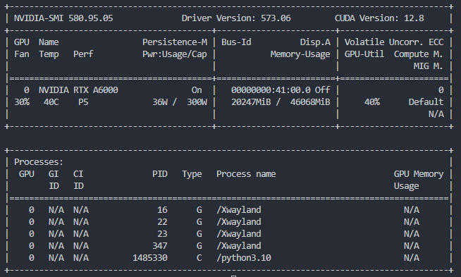
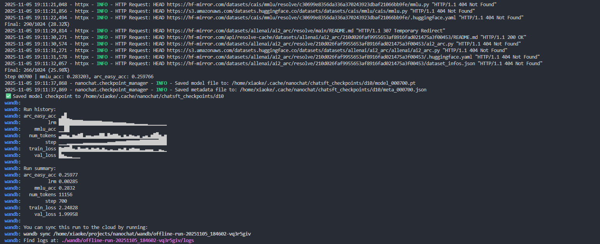
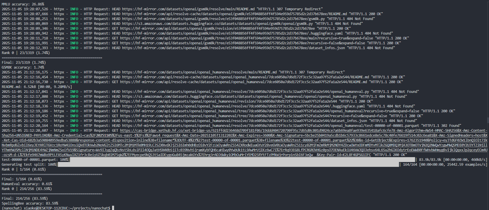
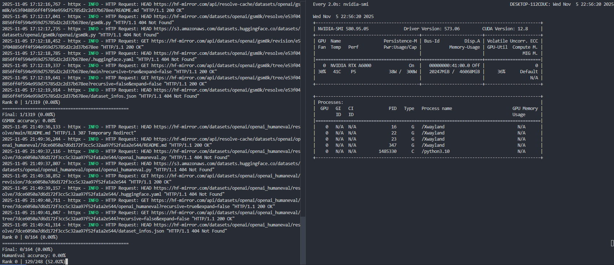

# nanochat-sft文章

## 一、基础原理

### 1. 背景

预训练，我们都知道，是让模型学习语言本身，学习海量知识。它的目标是预测下一个词。你给它半句话，它能补全。但这种补全，是基于互联网语料的“最可能”补全，而不是“最有帮助”的回答。

比如你问“法国的首都在哪里”，一个只预训练过的模型，很可能接着预测“法国最大的城市是哪个”，或者“法国的历史有多久”。它在延续话题，而不是在回答问题。

SFT，也就是监督微调，他的目标就是解决这个问题。它的任务是教模型如何对话和遵循指令。

在一个完整聊天模型流程里，比如从预训练到能聊天的 NanoChat，SFT 扮演的是“行为塑造”的初级阶段。

对比pretrain和sft来说，预训练是“学知识”，SFT 则是“学规矩”。

我们用 SFT 告诉模型，当用户输入一个提示 Prompt 时，模型应该输出一个有帮助的回答 Response，而不是续写这个提示。

SFT 塑造了模型作为助手的基本形态。它为后续的强化学习步骤比如 RLHF 打下了一个重要基础。没有 SFT，后续的 RLHF 会困难，因为模型根本不知道什么是回答。

我其中RLHF是为了对齐模型，就是让模型的行为目标和我们人类的期望或者说价值观保持一致。

我们希望模型是有帮助的，诚实的，以及无害的。

预训练模型的目标只是预测下一个词，这显然和我们人类的期望不对齐，因为我们想要的是模型输出一个回答，而不是一个补全的预测。

SFT 就是实现对齐的第一步，也是最直接的一步。我们通过准备好的高质量“指令-回答”数据对，直接向模型展示了什么才叫有帮助。

模型通过学习这些 SFT 数据，开始理解面对一个问题，应该提供答案，而不是延续文本。它把模型的输出方向，从最可能的文本校准到了最有帮助的回复上。

SFT 实现了基础、有监督的对齐。

### 2. midtrain 和 sft 有什么区别

在 NanoChat 的流程中，预训练和 SFT 中间还有一个重要阶段，叫做 Mid-training 中间训练。

你可能会问，我们不是刚做完预训练，又要马上做 SFT，为什么还要一个中间训练。

我认为它扮演的是“数据预热”的角色。预训练用的是海量互联网语料，而 SFT 用的是精选“指令-回答”数据。如果直接从预训练跳到 SFT，模型的“风格”跨度太大，训练起来可能很困难。

Mid-train 用的数据虽然也是 SmolTalk、MMLU、GSM8K 这类对话或问答数据，但它的训练任务，和预训练是完全一样的。

它们关键不同在于 mid_train 阶段对所有token 都计算损失，而 chat_sft 阶段只对回答部分的 token 计算损失。

**mid_train 格式**

mid_train 是类似预训练的。

在 mid_train.py 脚本中，数据生成器 mid_data_generator 的目标是预测序列中的每一个下一个 token。

它从 render_conversation 获取 token ID（ids），然后简单地将它们错开一位来创建 inputs 和 targets。

代码片段如下：

```python
# (在 mid_data_generator 内部)
# ... 从 token_buffer 填充 scratch ...
        for i in range(needed_tokens):
            scratch[i] = token_buffer.popleft()
        inputs_cpu = scratch[:-1].to(dtype=torch.int32)
        targets_cpu = scratch[1:]
        inputs = inputs_cpu.view(device_batch_size, max_seq_len).to(device=device, dtype=torch.int32, non_blocking=True)
        targets = targets_cpu.view(device_batch_size, max_seq_len).to(device=device, dtype=torch.int64, non_blocking=True)
        # ...
        yield inputs, targets
```

这里 targets 就是 inputs 向左平移一位。模型会对 targets 中的每一个 token 计算损失。

**chat_sft 格式**

在 chat_sft.py 脚本中，数据生成器 sft_data_generator 会额外获取一个 mask。

它的 targets 张量首先被全部填充为 -1（这是 PyTorch 损失函数中的“ignore index”）。

然后，它只把 mask 标记为 1 的位置（通常是助手的回答）的 token 填充到 targets 中。

代码片段如下（在 sft_data_generator -> collate_and_yield 函数中）：

```python
# (在 sft_data_generator -> collate_and_yield 内部)
        inputs = torch.full((nrows, ncols), pad_token_id, dtype=torch.long)
        targets = torch.full((nrows, ncols), -1, dtype=torch.long) # -1 是 ignore index
        for i, (ids, mask) in enumerate(batch):
            n = len(ids)
            ids_tensor = torch.tensor(ids, dtype=torch.long)
            inputs[i, :n-1] = ids_tensor[:-1]
            # ...
            row_targets = ids_tensor[1:]
            # ...
            mask_tensor = torch.tensor(mask[1:], dtype=torch.long)
            row_targets[mask_tensor == 0] = -1 # !!! 关键区别在这里 !!!
            targets[i, :n-1] = row_targets
```

#### 举个例子

假设我们有这样一段对话。

用户输入：你好, 对应 token ID [10, 11]
助手回答：你好呀, 很高兴, 对应 token ID [20, 21, 22, 23, 24]

把它们拼在一起, 完整的 token 序列 ids 就是 [10, 11, 20, 21, 22, 23, 24]。

同时, 我们还有一个 mask 序列, 告诉我们谁在说话。0 代表用户, 1 代表助手。 这个 mask 序列就是 [0, 0, 1, 1, 1, 1, 1], 和 ids 一一对应。

好, 现在我们来看模型在训练时到底看到了什么。

在语言模型训练中, inputs 总是序列的前 n-1 个, targets 总是序列的后 n-1 个。

所以, 无论是 midtrain 还是 sft, 它们看到的 inputs 都是一样的。 inputs 等于 ids[:-1], 也就是 [10, 11, 20, 21, 22, 23]

区别, 就在于 targets 是什么。

 **在 mid_train 中**：

打开 `mid_train.py` 脚本你可以发现, 它的任务是预测所有 token。所以它的 targets 就是简单地把 ids 向左平移一位。

targets 等于 ids[1:], 也就是 [11, 20, 21, 22, 23, 24]

模型在这一步需要 看到 [10], 预测 11 (用户的话) 看到 [10, 11], 预测 20 (助手的话) 看到 [10, 11, 20], 预测 21 (助手的话) 等等...

你看, 它对预测用户的话和助手的话都在计算损失。它是在熟悉这种对话的格式。

 **在 chat_sft 中**：

打开 `chat_sft.py` 脚本你可以发现, 它的任务是只预测助手的话。它实现这个目标, 就靠我们前面聊到的 -1 (忽略索引)。

首先, SFT 拿到的原始 targets 也是 [11, 20, 21, 22, 23, 24]。

但 SFT 还会拿到一个对应的 mask。 因为 targets 是从 ids 的第 2 个 token 开始的, 所以它用的 mask 也是从 mask 的第 2 个元素开始的。 这个 mask 就是 [0, 1, 1, 1, 1, 1]。

SFT 会这样做 targets: [11, 20, 21, 22, 23, 24] mask:     [ 0, 1, 1, 1, 1, 1]

它会检查 mask, 只要 mask 是 0, 它就把 targets 里对应的 token 换成 -1。

所以, 最终的 SFT targets 变成了 [-1, 20, 21, 22, 23, 24]

模型在这一步需要 看到 [10], 预测 11。但 11 在 targets 里是 -1, 损失被忽略, 不计分。 看到 [10, 11], 预测 20。20 在 targets 里是 20, 计分。 看到 [10, 11, 20], 预测 21。21 在 targets 里是 21, 计分。 等等...

这就是核心区别，他们的开始位置不一样，sft是在预测回答内容，mid_train是qa合并，从q的第一个词开始往后预测。

### 3. 为什么我们在 sft 的时候混合了多个任务

在上一部分, 我们提到了 SFT 监督微调如何将一个只有文本补全功能的模型转变为一个能基于指令回答问题。但是, 我们在实际的 `chat_sft.py` 脚本中, 并没有只使用用户提供的个性化聊天数据。

我们仍然保留了对 **ARC**, **GSM8K**, 和 **SmolTalk** 这些任务的训练。

这主要是由于灾难遗忘的存在。

我可以打个比方。预训练就像是模型用几十年时间读完了世界上所有的书, 成了一个通才。而你的个性化聊天数据, 是一本薄的, 关于“如何成为你私人朋友”的小册子。

当我们用这本小册子对模型进行微调时, 模型的参数会为了完全掌握这本小册子的内容而进行调整。

在这个过程中, 它很有可能会忘记掉它在预训练时学到的海量知识, 逻辑推理, 甚至常识。

模型就会变成一个擅长你的聊天风格, 但在回答一个科学问题, 或者进行小学数学运算时, 表现会下跌, 也就是我们说的变笨了。

我们保留 ARC 这类知识问答任务, 比如 `tasks/arc.py`, 以及 GSM8K 这类数学推理任务, 比如 `tasks/gsm8k.py`, 就是在避免模型遗忘过去学习到的知识。

通过将这些知识型任务与个性化任务混合在 `TaskMixture` 中, 我们可以持续向模型强调, **它不应该只学会如何聊天**。这种多任务的学习方式, 迫使模型在学习偏好对齐内容的同时, 必须保持住原有的通用能力。

## 二、代码实现

### 2.1 环境配置

如果你已经学习过前面 Pre-training/Mid-trainging/SFT 相关章节的学习并已做过环境配置，可以跳过环境配置。

本篇代码教程以 WSL上的 RTX A6000 服务器为例实现所有代码程序，环境选择 pytorch2.5.1+cu121，python3.10，cuda12.1（nvidia-smi 显示 CUDA 12.8），如下所示：

首先，读者需要创建一个新的环境，可以使用 Conda 或 uv 工具。例如：

使用 Conda：

```bash
conda create -n nanochat python=3.10
conda activate nanochat
```

或者使用 uv：

uv 是一种基于 Rust 实现的 Python 包管理工具。如果你还没有安装它，请用下面的命令进行安装。

```bash
command -v uv &> /dev/null || curl -LsSf https://astral.sh/uv/install.sh | sh
```

然后创建环境：

```bash
uv venv
source .venv/bin/activate  # 在 Linux/Mac 上
# 或在 Windows 上：.venv\Scripts\activate
uv sync
```

然后，设置环境变量并创建目录：

```bash
export OMP_NUM_THREADS=1  # 设置 OpenMP 线程数为 1，避免多线程冲突
export NANOCHAT_BASE_DIR="$HOME/.cache/nanochat"  # 设置 NanoChat 缓存目录
export HF_ENDPOINT=https://hf-mirror.com  # 设置 Hugging Face 镜像端点
mkdir -p $NANOCHAT_BASE_DIR  # 创建缓存目录
```

读者可以运行以下命令检查自己的环境：

```bash
# 检查 PyTorch 版本
python -c "import torch; print('PyTorch版本:', torch.__version__)"

# 检查 CUDA 是否可用
python -c "import torch; print('CUDA可用:', torch.cuda.is_available())"

# 检查 CUDA 版本
python -c "import torch; print('CUDA版本:', torch.version.cuda)"

# 检查 GPU 信息
nvidia-smi --query-gpu=name --format=csv,noheader,nounits
```



示例输出：

```bash
PyTorch版本: 2.5.1+cu121
CUDA可用: True
CUDA版本: 12.1
NVIDIA RTX A6000
```

项目依赖如下，读者可以复制以下内容保存为 `requirements.txt` 文件，然后运行 `pip install -r requirements.txt` 安装：

```txt
datasets>=4.0.0
fastapi>=0.117.1
files-to-prompt>=0.6
ipykernel>=7.0.1
notebook>=7.4.7
numpy==1.26.4
psutil>=7.1.0
regex>=2025.9.1
tiktoken>=0.11.0
tokenizers>=0.22.0
torch>=2.8.0
uvicorn>=0.36.0
wandb>=0.21.3
```

配置好环境之后就可以运行：

```bash
python -m scripts.chat_sft --run=$WANDB_RUN
```

注意：如果没有多卡设备，请不要使用 `torchrun --standalone --nproc_per_node=8 -m scripts.chat_sft -- --run=$WANDB_RUN` 命令，否则会导致报错。使用上面的 `python` 运行是单卡运行，不会报错。

`torchrun` 是 PyTorch 的分布式运行工具，用于启动多进程训练。`--standalone` 表示独立模式，不依赖外部调度器。`--nproc_per_node=8` 指定每个节点上的进程数为 8，表示使用 8 个 GPU。`-m scripts.chat_sft` 表示运行 `scripts.chat_sft` 模块。`--` 是参数分隔符，后面的 `--run=$WANDB_RUN` 是传递给脚本的参数，其中 `$WANDB_RUN` 是环境变量。

### 2.2 训练过程和结果

本文教程的 SFT 训练过程从 18:45:29 开始加载模型，到 19:11:37 保存检查点。这段时间大概是 26 分钟多一点，不过这其中包含了下载评测数据集和运行评测的时间。



它的输入模型是上一步 mid_train 训练完成的模型：`/home/xiaoke/.cache/nanochat/mid_checkpoints/d10 with step 813`。

我们看训练前后，模型在基准测试上的表现变化，以及训练本身的收敛情况。

| 指标 | SFT 训练前 (Mid-Train 结束) | SFT 训练后 (Step 700 结束) | 变化 |
| ---- | -------------------------- | -------------------------- | ---- |
| MMLU 准确率 | 约 28.22% (Step 600) | 28.32% | 提升 |
| ARC-Easy 准确率 | 约 26.86% (Step 600) | 25.98% | 下降 |
| 验证损失 (Val Loss) | 2.009828 (Step 600) | 1.999582 (Step 700) | 下降 |

验证损失从 2.009828 降到了 1.999582，虽然下降不多，但至少说明 SFT 目标数据集被模型学会了一些。

在 MMLU 和 ARC-Easy 这类知识推理测试上，准确率没有提高，甚至 ARC-Easy 还有退步。这通常说明 SFT 使用的数据集更侧重于对话能力和格式的学习，而不是知识和推理的提升。

### 2.3 评估

训练完成后，可以运行以下命令进行 SFT 模型的评估：

```bash
python -m scripts.chat_eval -i sft
```

注意：如果没有多卡设备，请不要使用 `torchrun --standalone --nproc_per_node=8 -m scripts.chat_eval -- -i sft` 命令，否则会导致报错。使用上面的 `python` 运行是单卡运行，不会报错。



运行输出的结果如下：

| 评测数据集 | 准确率 Accuracy | 难度与考察能力 | 上一轮 Mid-Train 结束时的结果 |
| ---------- | -------------- | -------------- | -------------------------- |
| ARC-Easy | 25.46% | 初级科学推理 | 25.21% |
| ARC-Challenge | 22.78% | 挑战级科学推理 | 24.49% |
| MMLU | 26.86% | 多学科知识与理解 | 28.32% |
| GSM8K | 1.74% | 数学应用题推理 | 暂无数据 |
| HumanEval | 0.61% | 代码生成与逻辑 | 暂无数据 |
| SpellingBee | 83.59% | 拼写能力与词汇 | 暂无数据 |

有部分的数据比如 midtrain 的评估数据没有是因为 midtrain 的评估需要很久，目前截止我写这篇文章的时候还没有跑完，所以就提前写出来了，而且中间评估的时候还中断了一下。



模型在 SpellingBee 上拿到了 83.59% 的高分，这通常表明模型在词汇和基础语言模式的学习上表现很好。这也是 SFT 训练带来的效果。MMLU 表现一般，但考虑到这是一个小模型，26.86% 还是一个起点。

我看到 MMLU 和 ARC-Challenge 的准确率比你在 SFT 训练中途看到的数值要低。这再次确认了我们的判断，即 SFT 训练关注的是对话格式，导致模型在知识和推理方面的泛化能力有所下降。

模型在 GSM8K 上的准确率只有 1.74%，在 HumanEval 上只有 0.61%。这两种评测分别考察复杂数学推理和代码生成能力，对小型语言模型来说难度很高。这么低的分数说明模型没有这方面的能力，如果未来想要提升这块，需要训练步骤。

### 2.4 核心代码讲解

#### 训练数据混合定义

我认为一个 SFT 训练集需要覆盖多种能力 才能让模型变得更全面。这里通过 `TaskMixture` 聚合了不同类型的数据集 包含了推理 算术 对话 拼写等任务 我很喜欢这种组合训练的思路。

```python
# 导入所需的任务数据集
from tasks.common import TaskMixture
from tasks.arc import ARC
from tasks.gsm8k import GSM8K
from tasks.smoltalk import SmolTalk
# ... 其他任务导入

# 定义训练数据集 这是一个多任务的混合体
train_ds = TaskMixture([
    ARC(subset="ARC-Easy", split="train"), # 逻辑推理
    GSM8K(subset="main", split="train"), # 数学推理
    SmolTalk(split="train", stop=10_000), # 通用对话
    CustomJSON(filepath=identity_conversations_filepath), # 身份/角色对话
    # ... 其他任务
])

# 定义验证数据集 通常选择一个通用的对话数据集
val_ds = SmolTalk(split="test")
```

#### 数据生成器与目标掩码

这部分是 SFT 中关键的步骤 因为它定义了损失函数如何计算 确保模型只学习预测**助手**的回复 而忽略用户输入和其他非生成部分 这就是所谓的**目标掩码**。

```python
def sft_data_generator(dataset, batch_size):
    # 使用 <|assistant_end|> 标记作为填充 token 在损失计算时会被屏蔽
    pad_token_id = tokenizer.encode_special("<|assistant_end|>")
    
    def collate_and_yield(batch):
        # ... (计算张量尺寸)
        
        # targets 目标张量中 -1 是 PyTorch 交叉熵损失函数中的忽略索引
        targets = torch.full((nrows, ncols), -1, dtype=torch.long)
        
        for i, (ids, mask) in enumerate(batch):
            # ... (处理输入 inputs)
            row_targets = ids_tensor[1:]
            
            # SFT 的核心: 屏蔽掉 mask 为 0 的目标 token 也就是用户输入的部分
            mask_tensor = torch.tensor(mask[1:], dtype=torch.long)
            row_targets[mask_tensor == 0] = -1 # 设置为 -1 忽略损失
            
            # 将处理好的目标序列赋值给 targets 张量
            targets[i, :n-1] = row_targets
            
        return inputs.to(device), targets.to(device)
    # ... (迭代数据集和生成批次)
```

#### 优化器初始化与训练循环

我从代码中看到它采用了对不同权重层设置不同学习率的策略 这是细致的做法。训练循环清晰地展示了**梯度累积** `grad_accum_steps` 和**学习率衰减** `get_lr_multiplier` 如何应用于每个训练步骤。

```python
# 初始化优化器 为模型不同参数组设置不同的学习率 是一种调优
optimizers = model.setup_optimizers(
    unembedding_lr=unembedding_lr,
    embedding_lr=embedding_lr,
    matrix_lr=matrix_lr,
    weight_decay=weight_decay,
)

# 学习率调度器 采用简单的线性衰减
def get_lr_multiplier(it):
    lrm = 1.0 - it / num_iterations
    return lrm

# 训练循环核心部分
for step in range(num_iterations):
    # 梯度累积
    for micro_step in range(grad_accum_steps):
        train_inputs, train_targets = next(train_iter)
        with autocast_ctx:
            # 前向传播 计算损失
            loss = model(train_inputs, train_targets)
            
        # 损失按梯度累积步数平均
        loss = loss / grad_accum_steps 
        loss.backward() # 累积梯度
        
    # 应用学习率调度
    lrm = get_lr_multiplier(step)
    for opt in optimizers:
        for group in opt.param_groups:
            group["lr"] = group["initial_lr"] * lrm

    # 优化器步进 清除梯度
    for opt in optimizers:
        opt.step()
    model.zero_grad(set_to_none=True)
    # ... (日志和评估)
```

恭喜你，到此就完成了本次nanochat sft部分的模型训练了！
