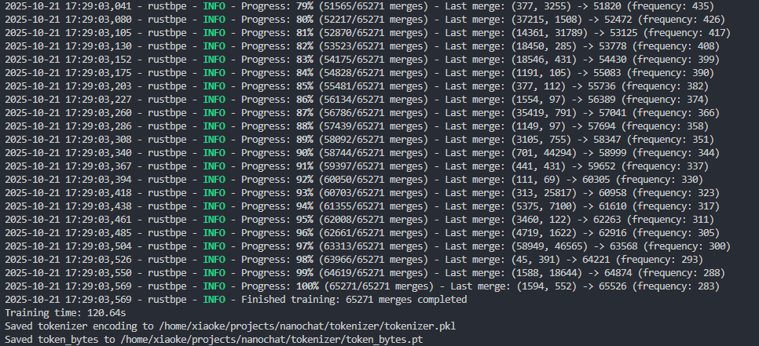
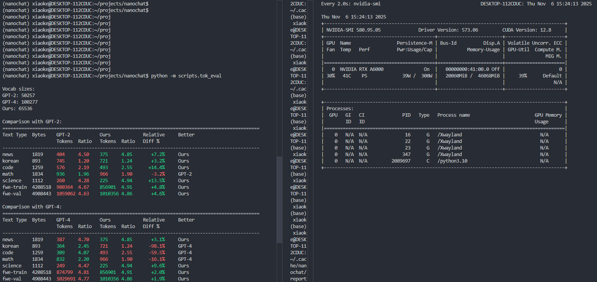
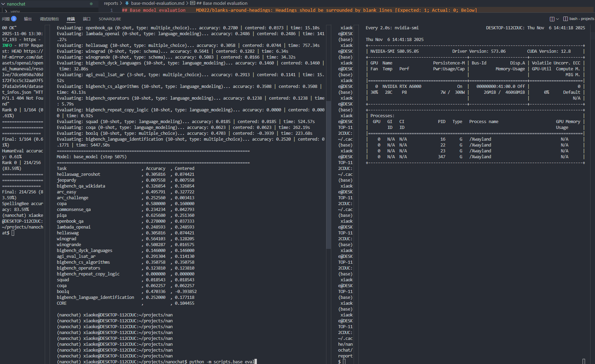

# Supervised Fine-Tuning（监督微调）

## 一、基础原理

### 1. 背景

预训练是让模型学习语言本身和海量知识。它的目标是预测下一个词。你给它半句话，它能补全。但这种补全是基于互联网语料的最可能补全，而不是最有帮助的回答。

比如你问"法国的首都在哪里"，一个只预训练过的模型很可能接着预测"法国最大的城市是哪个"或者"法国的历史有多久"。它在延续话题，而不是在回答问题。

SFT 也就是监督微调，目标是解决这个问题。它的任务是教模型如何对话和遵循指令。

在一个完整聊天模型流程里，比如从预训练到能聊天的 NanoChat，SFT 扮演的是行为塑造的初级阶段。

对比 pretrain 和 sft，预训练是学知识，SFT 则是学规矩。

我们用 SFT 告诉模型，当用户输入一个提示 Prompt 时，模型应该输出一个有帮助的回答 Response，而不是续写这个提示。

SFT 塑造了模型作为助手的基本形态。它为后续的强化学习步骤比如 RLHF 打下了基础。没有 SFT，后续的 RLHF 会困难，因为模型根本不知道什么是回答。

其中 RLHF 是为了对齐模型，让模型的行为目标和我们人类的期望或价值观保持一致。因为我们希望模型是有帮助的、诚实的以及无害的。

预训练模型的目标只是预测下一个词，这显然和我们人类的期望不对齐，因为我们想要的是模型输出一个回答，而不是一个补全的预测。

SFT 是实现对齐的第一步，也是最直接的一步。我们通过准备好的高质量指令-回答数据对，直接向模型展示了什么是有帮助的。

模型通过学习这些 SFT 数据，开始理解面对一个问题应该提供答案，而不是延续文本。它把模型的输出方向从最可能的文本校准到了最有帮助的回复上。

SFT 实现了有监督的对齐。

### 2. midtrain 和 sft 有什么区别

在 NanoChat 的流程中，预训练和 SFT 中间还有一个阶段，叫做 Mid-training 中间训练。

你可能会问，我们不是刚做完预训练，又要马上做 SFT，为什么还要一个中间训练。

我认为它主要的作用是数据预热。预训练用的是海量互联网语料，而 SFT 用的是精选指令-回答数据。如果直接从预训练跳到 SFT，模型的风格跨度太大，训练起来可能很困难。

Mid-train 用的数据虽然也是 SmolTalk、MMLU、GSM8K 这类对话或问答数据，但它的训练任务和预训练完全一样。

它们的关键区别在于 mid_train 阶段对所有 token 都计算损失，而 chat_sft 阶段只对回答部分的 token 计算损失。

**mid_train 格式**

mid_train 类似预训练。

在 mid_train.py 脚本中，数据生成器 mid_data_generator 的目标是预测序列中的每一个下一个 token。

它从 render_conversation 获取 token ID（ids），然后简单地将它们错开一位来创建 inputs 和 targets。

代码片段如下：

```python
# (在 mid_data_generator 内部)
# ... 从 token_buffer 填充 scratch ...
        for i in range(needed_tokens):
            scratch[i] = token_buffer.popleft()
        inputs_cpu = scratch[:-1].to(dtype=torch.int32)
        targets_cpu = scratch[1:]
        inputs = inputs_cpu.view(device_batch_size, max_seq_len).to(device=device, dtype=torch.int32, non_blocking=True)
        targets = targets_cpu.view(device_batch_size, max_seq_len).to(device=device, dtype=torch.int64, non_blocking=True)
        # ...
        yield inputs, targets
```

targets 是 inputs 向左平移一位，模型对 targets 中每个 token 都计算损失。

**chat_sft 格式**

在 `chat_sft.py` 中，数据生成器会获取一个 mask 来标记谁在说话。targets 被初始化为 -1（PyTorch 损失函数的 ignore_index），然后只把 mask 标记为 1 的位置（助手回答）的 token 放入 targets：

```python
# (在 sft_data_generator -> collate_and_yield 内部)
        inputs = torch.full((nrows, ncols), pad_token_id, dtype=torch.long)
        targets = torch.full((nrows, ncols), -1, dtype=torch.long) # -1 是 ignore index
        for i, (ids, mask) in enumerate(batch):
            n = len(ids)
            ids_tensor = torch.tensor(ids, dtype=torch.long)
            inputs[i, :n-1] = ids_tensor[:-1]
            # ...
            row_targets = ids_tensor[1:]
            # ...
            mask_tensor = torch.tensor(mask[1:], dtype=torch.long)
            row_targets[mask_tensor == 0] = -1 # !!! 关键区别在这里 !!!
            targets[i, :n-1] = row_targets
```

**具体例子**

假设我们有这样一段对话。

用户输入：你好，对应 token ID [10, 11]
助手回答：你好呀，很高兴，对应 token ID [20, 21, 22, 23, 24]

把它们拼在一起，完整的 token 序列 ids 就是 [10, 11, 20, 21, 22, 23, 24]。

同时，我们还有一个 mask 序列，告诉我们谁在说话。0 代表用户，1 代表助手。这个 mask 序列就是 [0, 0, 1, 1, 1, 1, 1]，和 ids 一一对应。

好，现在我们来看模型在训练时到底看到了什么。

在语言模型训练中，inputs 总是序列的前 n-1 个，targets 总是序列的后 n-1 个。

所以，无论是 midtrain 还是 sft，它们看到的 inputs 都是一样的。inputs 等于 ids[:-1]，也就是 [10, 11, 20, 21, 22, 23]

区别就在于 targets 是什么。

**在 mid_train 中**：

打开 `mid_train.py` 脚本你可以发现，它的任务是预测所有 token。所以它的 targets 就是简单地把 ids 向左平移一位。

targets 等于 ids[1:]，也就是 [11, 20, 21, 22, 23, 24]

模型在这一步需要看到 [10]，预测 11（用户的话）；看到 [10, 11]，预测 20（助手的话）；看到 [10, 11, 20]，预测 21（助手的话）等等。

你看，它对预测用户的话和助手的话都在计算损失。它在熟悉这种对话的格式。

**在 chat_sft 中**：

打开 `chat_sft.py` 脚本你可以发现，它的任务是只预测助手的话。它实现这个目标就靠我们前面提到的 -1（忽略索引）。

首先，SFT 拿到的原始 targets 也是 [11, 20, 21, 22, 23, 24]。

但 SFT 还会拿到一个对应的 mask。因为 targets 是从 ids 的第 2 个 token 开始的，所以它用的 mask 也是从 mask 的第 2 个元素开始的。这个 mask 就是 [0, 1, 1, 1, 1, 1]。

SFT 会这样做 targets：[11, 20, 21, 22, 23, 24] mask：[0, 1, 1, 1, 1, 1]

它会检查 mask，只要 mask 是 0，它就把 targets 里对应的 token 换成 -1。

所以最终的 SFT targets 变成了 [-1, 20, 21, 22, 23, 24]

模型在这一步需要看到 [10]，预测 11。但 11 在 targets 里是 -1，损失被忽略，不计分；看到 [10, 11]，预测 20。20 在 targets 里是 20，计分；看到 [10, 11, 20]，预测 21。21 在 targets 里是 21，计分。等等。

这就是核心区别。他们的开始位置不一样，sft 是在预测回答内容，mid_train 是 qa 合并，从 q 的第一个词开始往后预测。

### 3. 为什么在 sft 阶段混合多个任务

在 SFT 中保留 ARC、GSM8K、SmolTalk 这类任务，主要是为了应对灾难遗忘。

我可以打个比方。预训练就像是模型用几十年时间读完了世界上所有的书，成了一个通才。而你的聊天数据是一本薄的、关于如何成为你朋友的小册子。

当我们用这本小册子对模型进行微调时，模型的参数会为了完全掌握这本小册子的内容而进行调整。

在这个过程中，它很可能会忘记掉它在预训练时学到的海量知识、逻辑推理甚至常识。

模型就会变成一个擅长你的聊天风格，但在回答一个科学问题或者进行小学数学运算时表现会下跌，也就是我们说的变笨了。

我们保留 ARC 这类知识问答任务，以及 GSM8K 这类数学推理任务，就是为了避免模型遗忘过去学习到的知识。

通过将这些知识型任务与聊天任务混合在 `TaskMixture` 中，我们可以持续向模型强调它不应该只学会如何聊天。这种多任务的学习方式迫使模型在学习对话对齐内容的同时必须保持住原有的通用能力。

## 二、代码实现

### 2.1 环境配置

首先，克隆 NanoChat 仓库到本地：

```bash
git clone https://github.com/karpathy/nanochat
cd nanochat
```

如果你已经学习过前面 Pre-training/Mid-trainging 的章节并已做过环境配置，可以跳过环境配置。

本篇代码教程以 WSL 上的 RTX A6000 服务器为例实现所有代码程序，环境选择 PyTorch 2.9.0+cu128，Python 3.10.19，CUDA 12.8，如下所示：

首先，读者需要创建一个新的环境，可以使用 Conda 或 uv 工具。例如：

使用 Conda：

```bash
conda create -n nanochat python=3.10
conda activate nanochat
```

或者使用 uv：

uv 是一种基于 Rust 实现的 Python 包管理工具。如果你还没有安装它，请用下面的命令进行安装。

```bash
command -v uv &> /dev/null || curl -LsSf https://astral.sh/uv/install.sh | sh
```

然后创建环境：

```bash
uv venv
source .venv/bin/activate  # 在 Linux/Mac 上
# 或在 Windows 上：.venv\Scripts\activate
uv sync
```

然后，设置环境变量并创建目录：

```bash
export OMP_NUM_THREADS=1  # 设置 OpenMP 线程数为 1，避免多线程冲突
export NANOCHAT_BASE_DIR="$HOME/.cache/nanochat"  # 设置 NanoChat 缓存目录
export HF_ENDPOINT=https://hf-mirror.com  # 设置 Hugging Face 镜像端点
mkdir -p $NANOCHAT_BASE_DIR  # 创建缓存目录
```

读者可以运行以下命令检查自己的环境：

```bash
# 检查 PyTorch 版本
python -c "import torch; print('PyTorch版本:', torch.__version__)"

# 检查 CUDA 是否可用
python -c "import torch; print('CUDA可用:', torch.cuda.is_available())"

# 检查 CUDA 版本
python -c "import torch; print('CUDA版本:', torch.version.cuda)"

# 检查 GPU 信息
nvidia-smi --query-gpu=name --format=csv,noheader,nounits
```


示例输出：

```bash
PyTorch版本: 2.9.0+cu128
CUDA可用: True
CUDA版本: 12.8
NVIDIA RTX A6000
```

项目依赖如下，读者可以复制以下内容保存为 `requirements.txt` 文件，然后运行 `pip install -r requirements.txt` 安装：

```txt
datasets>=4.0.0
fastapi>=0.117.1
files-to-prompt>=0.6
ipykernel>=7.0.1
notebook>=7.4.7
numpy==1.26.4
psutil>=7.1.0
regex>=2025.9.1
tiktoken>=0.11.0
tokenizers>=0.22.0
torch>=2.8.0
uvicorn>=0.36.0
wandb>=0.21.3
```

配置好环境之后就可以运行：

```bash
python -m scripts.chat_sft --run=$WANDB_RUN
```

注意：如果没有多卡设备，请不要使用 `torchrun --standalone --nproc_per_node=8 -m scripts.chat_sft -- --run=$WANDB_RUN` 命令，否则会导致报错。使用上面的 `python` 运行是单卡运行，不会报错。

`torchrun` 是 PyTorch 的分布式运行工具，用于启动多进程训练。`--standalone` 表示独立模式，不依赖外部调度器。`--nproc_per_node=8` 指定每个节点上的进程数为 8，表示使用 8 个 GPU。`-m scripts.chat_sft` 表示运行 `scripts.chat_sft` 模块。`--` 是参数分隔符，后面的 `--run=$WANDB_RUN` 是传递给脚本的参数，其中 `$WANDB_RUN` 是环境变量。

### 2.2 训练过程和结果

SFT 训练从 18:45:29 开始加载模型，到 19:11:37 保存检查点，耗时约 26 分钟，包含了评测数据集下载和评测运行。

<span id="fig2.2"></span>
<div align="center">
  
  <span><p>图2.2 SFT 训练过程</p></span>
</div>

输入模型是上一步 mid_train 的结果：`/home/xiaoke/.cache/nanochat/mid_checkpoints/d10 with step 813`。

| 指标 | SFT 训练前 | SFT 训练后 | 变化 |
| ---- | --------- | --------- | ---- |
| MMLU 准确率 | 28.22% | 28.32% | +0.10% |
| ARC-Easy 准确率 | 26.86% | 25.98% | -0.88% |
| 验证损失 | 2.009828 | 1.999582 | -0.51% |

验证损失下降了 0.51%，说明 SFT 数据被模型学到。在知识推理测试上，准确率略有下降，表明 SFT 数据更侧重对话能力和格式，而非知识提升。

### 2.3 评估

训练完成后，可以运行以下命令进行 SFT 模型的评估：

```bash
python -m scripts.chat_eval -i sft
```

注意：如果没有多卡设备，请不要使用 `torchrun --standalone --nproc_per_node=8 -m scripts.chat_eval -- -i sft` 命令，否则会导致报错。使用上面的 `python` 运行是单卡运行，不会报错。

<span id="fig2.3"></span>
<div align="center">
  
  <span><p>图2.3 SFT 模型评估过程</p></span>
</div>

运行输出的结果如下：

<span id="tab2.1"></span>
<p>表2.1 SFT 模型评估结果</p>

| 评测数据集 | 准确率 | 难度与考察能力 |
| ---------- | ----- | -------------- |
| ARC-Easy | 25.46% | 初级科学推理 |
| ARC-Challenge | 22.78% | 挑战级科学推理 |
| MMLU | 26.86% | 多学科知识与理解 |
| GSM8K | 1.74% | 数学应用题推理 |
| HumanEval | 0.61% | 代码生成与逻辑 |
| SpellingBee | 83.59% | 拼写能力与词汇 |
| ChatCORE metric | 14.35% | 综合对话能力评分 |

模型在 SpellingBee 上拿到了 83.59% 的高分，这说明模型在词汇和基础语言模式的学习上表现很好。这也是 SFT 训练带来的效果。MMLU 表现一般，但考虑到这是一个小模型，26.86% 还算凑合。

模型在 GSM8K 上的准确率从中间训练阶段的 0.08% 提升到 1.74%，在 HumanEval 上从 0.00% 提升到 0.61%。虽然这两种评测分别考察数学推理和代码生成能力的分数仍然较低（对小型语言模型来说难度很高），但已经表现出通过 SFT 的学习获得了一定的能力提升。这说明多任务混合训练确实有助于模型获取多方面的能力。

### 2.4 核心代码讲解

#### 训练数据混合定义

这里通过 `TaskMixture` 聚合了不同类型的数据集包括推理、算术、对话、拼写等任务。

```python
# 导入所需的任务数据集
from tasks.common import TaskMixture
from tasks.arc import ARC
from tasks.gsm8k import GSM8K
from tasks.smoltalk import SmolTalk
# ... 其他任务导入

# 定义训练数据集 这是一个多任务的混合体
train_ds = TaskMixture([
    ARC(subset="ARC-Easy", split="train"), # 逻辑推理
    GSM8K(subset="main", split="train"), # 数学推理
    SmolTalk(split="train", stop=10_000), # 对话
    CustomJSON(filepath=identity_conversations_filepath), # 身份/角色对话
    # ... 其他任务
])

# 定义验证数据集 通常选择一个通用的对话数据集
val_ds = SmolTalk(split="test")
```

#### 数据生成器与目标掩码

SFT 的核心在于只对助手的回答计算损失：

```python
def sft_data_generator(dataset, batch_size):
    # 使用 <|assistant_end|> 标记作为填充 token 在损失计算时会被屏蔽
    pad_token_id = tokenizer.encode_special("<|assistant_end|>")
    
    def collate_and_yield(batch):
        # ... (计算张量尺寸)
        
        # targets 目标张量中 -1 是 PyTorch 交叉熵损失函数中的忽略索引
        targets = torch.full((nrows, ncols), -1, dtype=torch.long)
        
        for i, (ids, mask) in enumerate(batch):
            # ... (处理输入 inputs)
            row_targets = ids_tensor[1:]
            
            # SFT 的核心: 屏蔽掉 mask 为 0 的目标 token 也就是用户输入的部分
            mask_tensor = torch.tensor(mask[1:], dtype=torch.long)
            row_targets[mask_tensor == 0] = -1 # 设置为 -1 忽略损失
            
            # 将处理好的目标序列赋值给 targets 张量
            targets[i, :n-1] = row_targets
            
        return inputs.to(device), targets.to(device)
    # ... (迭代数据集和生成批次)
```

#### 优化器与学习率

```python
# 初始化优化器 为模型不同参数组设置不同的学习率
optimizers = model.setup_optimizers(
    unembedding_lr=unembedding_lr,
    embedding_lr=embedding_lr,
    matrix_lr=matrix_lr,
    weight_decay=weight_decay,
)

# 学习率调度器 采用线性衰减
def get_lr_multiplier(it):
    lrm = 1.0 - it / num_iterations
    return lrm

# 训练循环核心部分
for step in range(num_iterations):
    # 梯度累积
    for micro_step in range(grad_accum_steps):
        train_inputs, train_targets = next(train_iter)
        with autocast_ctx:
            # 前向传播 计算损失
            loss = model(train_inputs, train_targets)
            
        # 损失按梯度累积步数平均
        loss = loss / grad_accum_steps 
        loss.backward() # 累积梯度
        
    # 应用学习率调度
    lrm = get_lr_multiplier(step)
    for opt in optimizers:
        for group in opt.param_groups:
            group["lr"] = group["initial_lr"] * lrm

    # 优化器步进 清除梯度
    for opt in optimizers:
        opt.step()
    model.zero_grad(set_to_none=True)
    # ... (日志和评估)
```

## 三、完整训练报告

### 3.1 训练环境

<span id="tab3.1"></span>
<p>表3.1 训练环境配置</p>

| 配置项 | 详情 |
| ------ | ---- |
| 平台 | Linux |
| CPU | 32 核（64 逻辑核） |
| 内存 | 125.7 GB |
| GPU | 1x NVIDIA RTX A6000 |
| GPU 显存 | 46.0 GB |
| CUDA 版本 | 12.8 |
| Python | 3.10.19 |
| PyTorch | 2.9.0+cu128 |

### 3.2 分词器训练

分词器使用 FineWeb Edu 100B Shuffle 数据集训练。这是 Karpathy 构建的教育内容语料库。

代码位置：`scripts/tok_train.py`

**训练参数**

<span id="tab3.2"></span>
<p>表3.2 分词器训练参数</p>

| 参数 | 值 |
| ---- | ---- |
| 训练时间 | 2025-10-31 17:53:24 |
| 最大字符数 | 2,000,000,000 |
| 文档上限 | 10,000 |
| 词汇表大小 | 65,536 |
| 训练耗时 | 117.36 秒 |
| 特殊 token 数 | 9 |
| token 字节最小值 | 1 |
| token 字节最大值 | 32 |
| token 字节平均值 | 6.92 |
| token 字节标准差 | 2.87 |

分词器采用了 65,536 的词汇表大小。我们训练了 9 个特殊 token 来处理对话中的特殊标记。
九个特殊 token 如下，分别用于对话与工具标记。

```text
<|bos|> 文档起始标记
<|user_start|> 用户消息开始
<|user_end|> 用户消息结束
<|assistant_start|> 助手消息开始
<|assistant_end|> 助手消息结束
<|python_start|> 助手调用 Python 工具开始
<|python_end|> 助手调用 Python 工具结束
<|output_start|> Python 工具输出开始
<|output_end|> Python 工具输出结束
```

<span id="fig3.1"></span>
<div align="center">
  
  <span><p>图3.1 分词器训练过程</p></span>
</div>

从上面的训练过程可以看到，分词器在 117.36 秒内完成了词汇表构建的过程。最终生成的 token 平均字节长度为 6.92。

**分词器对比评估**

<span id="tab3.3"></span>
<p>表3.3 分词器与 GPT-2/GPT-4 对比</p>

| 文本类型 | GPT-2 | 我们的 | vs GPT-2 | GPT-4 | vs GPT-4 |
| --- | --- | --- | --- | --- | --- |
| 新闻 | 4.50 | 4.85 | +7.2% | 4.70 | +3.1% |
| 代码 | 2.19 | 2.55 | +14.4% | 4.07 | -59.5% |
| 数学 | 1.96 | 1.90 | -3.2% | 2.20 | -16.1% |
| 科学 | 4.28 | 4.94 | +13.5% | 4.47 | +9.6% |
| 训练数据 | 4.67 | 4.91 | +4.8% | 4.81 | +2.0% |
| 验证数据 | 4.63 | 4.85 | +4.6% | 4.76 | +2.0% |

我们的分词器在整体数据集上接近 GPT-4。在科学文本上相比 GPT-2 提升 13.5%，说明对科学术语的学习良好。

<span id="fig3.5"></span>
<div align="center">
  
  <span><p>图3.5 分词器评估结果</p></span>
</div>

### 3.3 三阶段模型对比

<span id="fig3.2"></span>
<div align="center">
  
  <span><p>图3.2 预训练模型评估结果</p></span>
</div>

<span id="fig3.3"></span>
<div align="center">
  
  <span><p>图3.3 中间训练模型评估结果</p></span>
</div>

<span id="fig3.4"></span>
<div align="center">
  
  <span><p>图3.4 SFT 模型评估结果</p></span>
</div>

<span id="tab3.4"></span>
<p>表3.4 三阶段模型对比</p>

| 数据集 | Pre-Train | Mid-Train | SFT | 变化 |
| ------ | --------- | --------- | --- | ---- |
| ARC-Easy | 32.77% | 25.21% | 25.46% | ↓ 稳定 |
| ARC-Challenge | 0.34% | 24.49% | 22.78% | ↑ 后降 |
| MMLU | 26.15% | 28.32% | 26.86% | ↑ 后降 |
| GSM8K | 0.08% | 0.08% | 1.74% | ↑ 持续 |
| HumanEval | 0.00% | 0.00% | 0.61% | ↑ 持续 |
| SpellingBee | - | 52.73% | 83.59% | ↑ |
| ChatCORE | - | 8.99% | 14.35% | ↑ |

从三阶段演进可见：

**预训练到中间训练**，推理能力有大幅提升

ARC-Challenge 从 0.34% 提升到 24.49%，提升 72 倍。这得益于对话数据中的问答格式。

ARC-Easy 下降到 25.21% 是灾难遗忘的表现。

**中间训练到 SFT**，对话能力进一步优化。

SpellingBee 从 52.73% 提升到 83.59%，ChatCORE 从 8.99% 提升到 14.35%。

数学和代码能力有小幅提升（GSM8K 0.08% → 1.74%，HumanEval 0.00% → 0.61%）。

知识推理能力出现下降（MMLU 28.32% → 26.86%，ARC-Challenge 24.49% → 22.78%）。

**预训练到 SFT 的整体走向**。
科学推理下降 7.31%（ARC-Easy），但推理能力提升 22.44%（ARC-Challenge）。对话能力表现最为明显。三个阶段相互配合，既保留原有知识，又适应对话交互的需求。

### 3.4 各阶段训练参数

#### 基础模型训练

数据来自 FineWeb Edu 100B Shuffle 的 parquet 分片。代码位置：`scripts/base_train.py`

<span id="tab3.5"></span>
<p>表3.5 基础模型训练参数</p>

| 参数 | 值 |
| ---- | ---- |
| 模型参数 | 133,038,080 |
| 训练 token 总数 | 2,660,761,600 |
| 迭代次数 | 5,075 |
| 训练时间 | 411.22 分钟 |
| 最小验证损失 (bpb) | 0.9546 |
| 峰值显存 | 34.3 GB |

#### 中间训练

训练集包含多个任务。代码位置：`scripts/mid_train.py`

<span id="tab3.6"></span>
<p>表3.6 中间训练参数</p>

| 参数 | 值 |
| ---- | ---- |
| 数据类型 | bfloat16 |
| 设备批量大小 | 32 |
| 最大序列长度 | 2048 |
| 嵌入层学习率 | 0.2000 |
| 矩阵学习率 | 0.0200 |
| 反嵌入层学习率 | 0.0040 |
| 评估间隔 | 150 步 |
| 迭代次数 | 813 |
| 最小验证损失 (bpb) | 0.8557 |

训练集混合：SmolTalk (~46万)、MMLU (~10万)、GSM8K (~8,000)、身份对话 (~1,000)、SimpleSpelling (~20万)、SpellingBee (~8万)

#### SFT 训练

代码位置：`scripts/chat_sft.py`

<span id="tab3.7"></span>
<p>表3.7 SFT 训练参数</p>

| 参数 | 值 |
| ---- | ---- |
| 数据类型 | bfloat16 |
| 设备批量大小 | 4 |
| 训练样本数 | 22,439 |
| 迭代次数 | 701 |
| 训练损失 | 2.2483 |
| 验证损失 | 1.9996 |
| 评估间隔 | 100 步 |

训练集混合：ARC-Easy (~2,300)、ARC-Challenge (~1,100)、GSM8K (~8,000)、SmolTalk (~10,000)、身份对话 (~1,000)、SimpleSpelling (300)、SpellingBee (300)

恭喜你🎉，NanoChat SFT 阶段训练完成！
