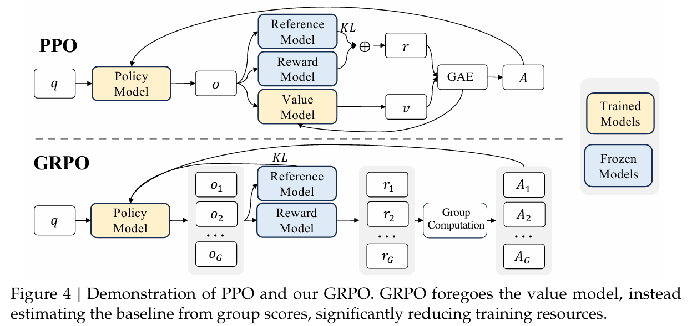
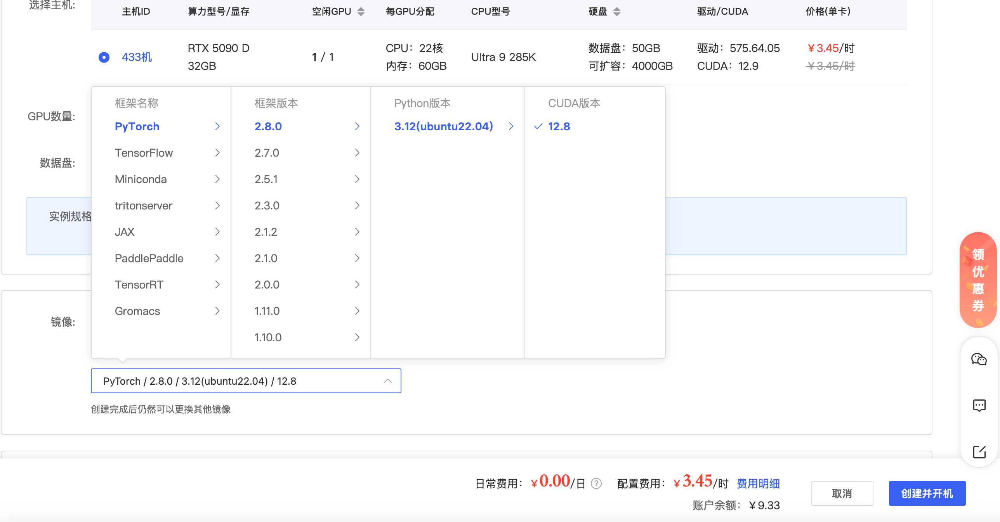
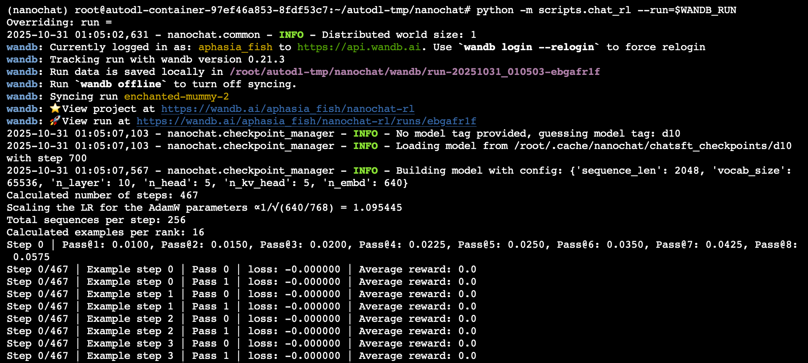
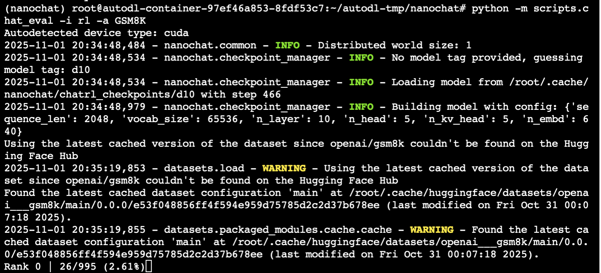

# 第九章 强化学习

Hi 大家好，欢迎来到新的篇章--强化学习篇。

在之前的章节中，我们见证了大语言模型如何通过预训练获得海量知识，并通过指令微调来学习遵循指令。然而，一个核心问题依然存在：**如何让模型的输出不仅正确，而且更安全、更无害、更符合人类的价值观和偏好？**

这正是强化学习大展身手的舞台。它不满足于让模型仅仅“模仿”已有的答案，而是赋予它一种通过试错和反馈来自主探索更优解的能力。这意味着我们能够通过定义“奖励”来引导模型生成“更符合我们偏好”的文本序列。

然而，将过去经典的强化学习算法应用于千亿参数的大模型时，我们面临着计算开销的难题。以曾风靡一时的 PPO 算法为例，它需要一个额外的“价值网络”来评估状态的好坏，这在大模型场景下意味着近乎翻倍的计算与存储开销，让本已沉重的训练过程雪上加霜。

难道没有一条更轻盈、更直接的路径吗？

这正是当前大模型强化学习领域备受关注的 GRPO算法 所要回答的问题。作为该领域的新兴主流方法，它由 DeepSeek 团队提出，并已成功应用于我们熟知的DeepSeek-R1 等模型。GRPO 做出了一项巧妙的革新：它摒弃了训练昂贵价值网络的传统，转而在同一批提示下生成多个回答，并利用它们之间的相互比较来构建一个稳定的优化目标。这种方法不仅大幅节约了训练资源，更在数学推理、代码生成和对齐等需要精细优化的任务中，展现出了卓越的性能和稳定性。

在本篇中，我们将系统介绍强化学习算法的基本原理，并以 GRPO 算法为例，从理论推导、代码实现到训练实践，全方位解析如何将强化学习有效应用于大模型的微调过程中。


## 一、基础原理

### 1. 背景

无论是做推荐系统、对话系统，还是在数学推理、大语言模型对齐（Alignment）场景里，最终我们都希望模型能输出“更优”或“更符合某些偏好”的序列。深度强化学习（DRL）借用“奖励”（reward）来衡量我们希望的目标，从而对生成的过程进行引导。**策略优化（Policy Optimization，PG）** 则是其中一个关键方法论。

在语言模型的应用中，比如要让模型解出数学题、满足人类对话偏好（例如避免不良输出，或给出更详细解释），我们往往先用大规模的无监督或自监督训练打下基础，然后通过一些“监督微调”（SFT）再进一步让模型学会初步符合需求。然而，SFT 有时难以将人类或某些高层目标的偏好显式地整合进去。这时，“**强化学习微调**”就登场了。**近端策略优化（Proximal Policy Optimization，PPO）** 是其中的代表性算法，但它同样有自己的痛点，比如PPO在进行策略优化时需要依赖价值网络来估计优势函数（Advantage Function），然而在高达千亿级别的大模型的训练场景中，价值网络的计算和存储成本极高。此外，PPO的奖励稀疏性问题和价值网络训练的复杂性进一步限制了其在大模型场景下的效率。

**分组相对策略优化（Group Relative Policy Optimization，GRPO）** 算法正是在此背景下闪亮登场。它是 DeepSeek 团队在论文《DeepSeekMath: Pushing the Limits of Mathematical Reasoning in Open Language Models》中提出的一种策略优化的算法，在当前火热的 R1 模型中也应用了该算法来实现强化学习。在 GRPO 中，不再需要像 PPO 那样加入额外的价值函数近似，而是**直接使用多个采样输出的平均奖励作为 Baseline**，显著减少了训练资源的使用。



### 2. 从 PG 到 PPO 的思想发展

#### 2.1 PG 与 Actor-Critic 范式

策略梯度方法（Policy Gradient，PG）是一种强化学习算法，其核心思想是直接对策略函数进行优化。策略函数通常表示为 $π_θ​(a∣s)$，即在状态 s 下选择动作 a 的概率，由参数 θ 决定。PG算法的目标是通过调整参数 θ，使得期望回报最大化。期望回报是指从当前状态开始，按照策略 $π_θ$​ 行动所获得的长期累积奖励的期望值。PG算法与价值迭代和Q-learning相比，不需要枚举所有状态-动作组合或学习中间的 Q(s,a) 值函数，因此在高维连续动作空间和复杂任务中具有更好的适应性和灵活性。

REINFORCE 算法是一种简单且经典的基于策略梯度的强化学习方法，它利用蒙特卡洛方法采样完整的轨迹，计算策略梯度来更新策略参数 θ，从而增加产生高回报动作的概率。其算法流程如下：

1. **采样轨迹**：根据当前策略 $πθ​ $与环境交互，采样一条完整的轨迹： $(s0​,a0​,r0​,s1​,a1​,r1​,…,sT​)$。

2. **计算折扣回报**：对于每个时间步 t，计算从该时间步开始的折扣回报 $G_t​=\sum\limits_{k=0}^{T-t}\gamma^{k}\cdot{r_{t+k}}$​ ，其中 $γ$ 是折扣因子。

3. **计算梯度**：根据策略梯度定理，计算梯度 $∇_θ​J(θ)\approx\sum\limits_{t=0}^T∇_\theta\log{\pi_\theta}({a_t|s_t})\cdot{G_t}$​，即每个动作的对数概率梯度乘以对应的折扣回报。

4. **更新策略**：使用梯度上升法更新策略参数 θ，即 $θ←θ+α∇_θ​J(θ)$，其中 α 是学习率。

不过，如果单纯用 REINFORCE 等策略梯度方法，基于采样来估计梯度，每一步更新都可能有很大方差，甚至出现学习过程不稳定现象。为此，研究者们提出了Actor-Critic框架：将“策略”叫做Actor，将“价值函数”叫做Critic，两者共同训练，让Critic起到估计价值、降低方差的作用。

#### 2.2 PPO 的核心思路：clip 与优势函数

后来又有了**近端策略优化（PPO）**，它是在 Actor-Critic 的基础上，为了避免策略更新太猛导致训练不稳定，引入了一个**剪切 (clip)** 技巧，即把 $\frac{π_θ(a_t,s_t)}{\pi_{old}(a_t,s_t)}$ 这个新旧策略的概率比例给夹在 $[1-\xi,1+\xi]$ 区间内。这样就能防止每次更新过度，从而保持相对稳定。但要在实践中实现 PPO，需要在每个时间步都有一个价值网络去估计优势函数 $A _t＝r_t+\gamma{V_\psi}(s_{t+1})-V_\psi(s_t)$，或者更常用的是广义优势估计（GAE），来让更新时的方差更小。

可问题在于，当我们的模型规模急剧增加——如在数十亿甚至千亿参数的语言模型上搞 PPO，就会发现训练资源消耗巨大。因为这个价值网络本身通常要和策略网络“同样大”或近似大，并且需要在每个token都计算价值，从而带来可观的内存占用与计算代价。

这就是 GRPO 的问题背景：**如何在保证 PPO 那样的收益（稳定、可控等）前提下，减少对昂贵价值网络的依赖？** 这背后的核心思路就是：用“分组输出相互比较”的方式来估计基线（Baseline），从而免去对价值网络的需求。

### 3、GRPO算法原理及实现

#### 3.1 核心思想

在许多实际应用中，奖励只有在序列末端才给一个分数（称之为 Result/Oucome Supervision），或在每一步给一些局部分数（Process Supervision）。不管怎么样，这个奖励本身往往是离散且比较稀疏的，要让价值网络去学习每个 token 的价值，可能并不划算。而如果我们在同一个问题 q 上采样多份输出 $o_1, o_2 , … , o_G$ ，将它们的奖励值进行对比，就能更好地推断哪些输出更好。由此，就能对每个输出的所有 token 做相对评分，无须明确地学到一个价值函数。

在数理推理、数学解题等场景，这个技巧尤其管用，因为常常会基于同一个题目 q 生成多个候选输出，有对有错，或者优劣程度不同。那就把它们的奖励进行一个分组内的比较，以获取相对差异，然后**把相对优势视为更新策略的依据**。

#### 3.2 算法原理

组相对策略优化（GRPO）算法（于 24 年 DeepSeek-MATH 那篇论文中提出），该方法没有使用通常与策略模型大小相同的 critic 模型，而是从组分数估计基线。

具体来说，对于每个问题 q ，GRPO 从旧策略 $π_{θ_{old}}$ 中抽取一组输出 $\{o_1, o_2, ..., o_G\}$ ，然后通过最大化以下目标来优化策略模型 $π_θ $：

$J_{\text{GRPO}}(\theta) = \mathbb{E}\left[\sum_{i=1}^G \sum_{t=1}^{|o_i|} \min\left(r_i(\theta) \tilde{A}_i, \, \text{clip}(r_i(\theta), 1-\epsilon, 1+\epsilon) \tilde{A}_i\right)\right] - \beta D_{\text{KL}}(\pi_\theta || \pi_{\text{ref}})$

其中，$r_i(\theta) = \frac{\pi_\theta(o_i|q)}{ \pi_{\theta_{\text{old}}}(o_i|q)}， \mathbb{D}_{KL}\left(\pi_{\theta} \| \pi_{\text{ref}}\right) = \frac{\pi_{\text{ref}}(o_i | q)}{\pi_{\theta}(o_i | q)} - \log \frac{\pi_{\text{ref}}(o_i | q)}{\pi_{\theta}(o_i | q)} - 1$，

*ε* 和 *β* 是超参数，$ A_i $ 是优势，使用对应于每个组内输出的奖励组 ${r_1,r_2,…,r_G} $ 计算得到：

$Ai=\frac{ri−mean({r1,r2,⋯,rG})}{std({r1,r2,⋯,rG})}$

对目标函数的详解：

- $\frac{\pi_{\theta}(o_i | q)}{\pi_{\theta_{\text{old}}}(o_i | q)} $表示新模型和旧模型在同一输入下得到同一输出的概率比，用于限制更新速度，避免原始模型能力的丧失。

- clip函数也是为了将更新限制在一定范围内，即将 $\frac{\pi_{\theta}(o_i | q)}{\pi_{\theta_{\text{old}}}(o_i | q)} 限制在 [1 - \epsilon, 1 + \epsilon]$ 之间。

- 采用 Advantage 而不是 Reward，目的是为了考虑当前回答相比其他回答的优劣。

- GRPO通过使用reward model来简化计算，减少了对critic model的依赖，降低了内存和计算成本。

- KL散度惩罚项，强制新策略与参考策略 $π_\text{ref}$ 接近，也是为了防止策略偏离特定约束（如安全策略或预训练模型）。

#### 3.3 算法流程

（1）采样

首先对于每个问题q，从当前策略 $π_θ​ $中采样一组输出$ \{o_1​,…,o_G​\}$，其中 G 是组内样本的数量，通常G=4~8。

（2）计算奖励

使用奖励模型或基于规则的奖励函数对组内所有输出进行评分，得到原始奖励$\{r_1, r_2, ..., r_G\}$，然后通过归一化处理得到相对奖励，作为优势估计。

具体来说，对奖励进行组内标准化，生成相对优势值：$\tilde{A}_i = \frac{r_i - \text{mean}(r)}{\text{std}(r)}$，这样就可将每个输出的奖励转换为相对于组内均值的偏离程度，有效消除了全局基线偏差。

（3）更新策略

类似于PPO，GRPO通过裁剪概率比（clip operation）和KL散度约束来优化策略，确保策略更新的稳定性。它的优化目标如下：

$J_{\text{GRPO}}(\theta) = \mathbb{E}\left[\sum_{i=1}^G \sum_{t=1}^{|o_i|} \min\left(r_i(\theta) \tilde{A}_i, \, \text{clip}(r_i(\theta), 1-\epsilon, 1+\epsilon) \tilde{A}_i\right)\right] - \beta D_{\text{KL}}(\pi_\theta || \pi_{\text{ref}})$

其中，$r_i(\theta) = \frac{\pi_\theta(a_t|s_t)}{ \pi_{\theta_{\text{old}}}(a_t|s_t)}$

通过Clip限制重要性权重$r_i(\theta)$ ，防止策略更新过大，确保训练稳定性。

KL 正则用来限制策略和一个参考策略（通常是初始 SFT 模型或当前$\pi_{\theta_{old}}$之间不要差异过大，以防训练崩坏。


## 二、代码实现

### 2.1 环境配置

本篇代码教程以 autodl 上租的单卡 5090 D 服务器为例实现所有代码程序，镜像框架选择 pytorch2.8.0，python3.10，cuda12.8，如下图所示：



准备好服务器后，请打开服务器的终端，进行相关环境配置。如果你已经学习过前面 Pre-training/Mid-trainging/SFT 相关章节的学习并已做过环境配置，则可以跳过 2.1 节。

首先，打开终端，输入下面命令来拉取 nanochat：

```bash
git clone git@github.com:karpathy/nanochat.git
```

接下来，用下面的命令设置默认的中间工件目录在 ~/.cache/nanochat 中，并设置 Hugging Face 国内镜像。

```bash
export OMP_NUM_THREADS=1
export NANOCHAT_BASE_DIR="$HOME/.cache/nanochat"
export HF_ENDPOINT=https://hf-mirror.com
mkdir -p $NANOCHAT_BASE_DIR
```
接下来，我们需要用 uv 搭建一个 python 虚拟环境。

uv 是一种基于 Rust 实现的现代化 Python 包管理工具。如果你还没有安装它，请用下面的命令进行安装。
```bash
command -v uv &> /dev/null || curl -LsSf https://astral.sh/uv/install.sh | sh
```

然后，用 uv 创建一个本地 venv 虚拟环境，并安装本教程需要用到的 python 依赖库。

```bash
[ -d ".venv" ] || uv venv  # 创建本地 venv 环境
uv sync --extra gpu  # 安装相关依赖库
source .venv/bin/activate  # 激活 venv 环境
```

至此你已经完成了所需要的环境配置！

我们还建议你使用 wandb 来记录训练过程中的日志，如 loss 曲线、reward 曲线等等，来观察模型在训练过程中的表现。

- 不设置 WANDB_RUN 则跳过 wandb 日志。
- 设置后可在 [wandb 网页](https://docs.wandb.ai/platform/hosting) 实时查看 loss、梯度、样本等。

如果你需要，可以用下面的命令下载并配置 wandb 。

```bash
pip install wandb  # 下载 wandb 包
wandb login  # 登陆 wandb，此处需要你登陆 wandb 官网并获取你的 API Key。
if [ -z "$WANDB_RUN" ]; then
    WANDB_RUN=dummy
fi
```

### 2.2 训练实践

我们以用 GRPO 强化学习算法在 GSM8K 数学问答数据集上后训练一个 LLM 为例，来感受强化学习的魅力。

完整的训练代码在 `./nanochat/scripts/chat_rl.py` 文件当中。你可以通过下面的命令直接在终端运行该脚本：

若你是单机单卡，请在终端运行以下命令开启训练：
```bash
cd autodl-tmp/nanochat
python -m scripts.chat_rl --run=$WANDB_RUN
```

若你是单机多卡，请在终端运行以下命令开启训练：
```bash
cd autodl-tmp/nanochat
torchrun --standalone --nproc_per_node=8 -m scripts.chat_rl -- --run=$WANDB_RUN    # 此处以单机八卡为示例，若为其他卡数请修改参数 nproc_per_node
```

然后请耐心等待训练完成（单机单卡大概需要4h），你可以在终端看到打印的日志，在 wandb 平台上看到训练曲线的变化，如下图所示。



训练完成后，你可以通过 `./nanochat/scripts/chat_rl.py` 脚本对训练后的模型在 GSM8K 测试集上进行评测：

若你是单机单卡，请在终端运行以下命令进行评测：
```bash
cd autodl-tmp/nanochat
ython -m scripts.chat_eval -i rl -a GSM8K
```

若你是单机多卡，请在终端运行以下命令进行评测：
```bash
cd autodl-tmp/nanochat
torchrun --standalone --nproc_per_node=8 -m scripts.chat_eval -- -i rl -a GSM8K    # 此处以单机八卡为示例，若为其他卡数请修改参数 nproc_per_node
```

你会看到一个如下的输出，显示评测过程和模型在评测集上的准确率：



### 2.2.3 代码实现

在本节，我们将手把手教您如何使用 GRPO 算法对大语言模型进行强化学习训练，在 GSM8K 数学问答数据集上后训练一个 LLM，使其生成更准确、更有逻辑的回答。

它涉及到以下方法设计：

- 使用策略梯度方法；
- 不使用 PPO 的 clip（剪裁） 和 trust region（置信阈）；
- 不使用 KL 正则化；
- 使用 token-level 的 GAPO 风格归一化；
- 使用 (r - mu) 作为 advantage（而不是 (r - mu)/sigma）；
- 使用分布式训练（支持 DDP）；
- 使用 Wandb 进行日志记录。

接下来我们将开始逐一学习这份训练代码，看它是如何一步一步实现训练的。

请先在 `./nanochat` 文件目录下新建 `train_grpo.py` 文件，然后按下面的方式一步一步学习和撰写代码。

Step1：导入相关依赖包和参数配置：

```python
import os
import torch
import torch.distributed as dist
from nanochat.common import compute_init, compute_cleanup, print0
from nanochat.engine import Engine
from tasks.gsm8k import GSM8K

# 关键超参数配置
run = "d10"    # wandb运行名称
source = "sft"    # 基础模型来源，可以选择 sft/mid
device_batch_size = 8    # 防止OOM的设备批大小
examples_per_step = 16    # 每步训练样本数（所有rank总计）
num_samples = 16    # 每个问题生成的回答数量
max_new_tokens = 256    # 最大生成token数
temperature = 1.0    # 采样温度，范围为[0,1]
```

Step2：进行分布式训练初始化：

```python
# 初始化分布式训练环境
ddp, ddp_rank, ddp_local_rank, ddp_world_size, device = compute_init()
master_process = ddp_rank == 0  # master_process 表示是否为主进程，用于日志和保存模型

# 设置混合精度训练
dtype = torch.bfloat16
autocast_ctx = torch.amp.autocast(device_type="cuda", dtype=dtype)

# 初始化 wandb 日志记录。如果不是主进程或 run 为 dummy，使用 dummy wandb（不记录日志）。
use_dummy_wandb = run == "dummy" or not master_process
wandb_run = DummyWandb() if use_dummy_wandb else wandb.init(project="nanochat-rl", name=run, config=user_config)

# 加载基础模型和分词器
model, tokenizer, meta = load_model(source, device, phase="eval")
engine = Engine(model, tokenizer)  # Engine 封装了生成逻辑，用于生成 rollout 样本
```

Step3：加载数据集

```python
# 加载GSM8K训练集和测试集
train_task = GSM8K(subset="main", split="train")
val_task = GSM8K(subset="main", split="test")

# 计算总训练步数
num_steps = (len(train_task) // examples_per_step) * num_epochs
print0(f"总训练步数: {num_steps}")
```

Step4：设计奖励函数。GSM8K 任务使用内置的奖励函数，它会：
- 解析模型生成的数学推理过程
- 提取最终答案并与标准答案比较
- 返回 1（正确）或 0（错误）

Step5：get_batch 函数，用于生成样本并计算优势

函数 get_batch 是GRPO算法的核心，负责生成训练样本并计算优势函数。具体来说，它能够：
- 无限循环生成训练数据。
- 为每个样本生成 n 个回答，并计算奖励，构造训练输入。

```python
@torch.no_grad()   # 用于禁用梯度计算。因为这个函数只用于生成样本，不参与反向传播

def get_batch():
    assistant_end = tokenizer.encode_special("<|assistant_end|>")    # 获取用于 pad 的填充 token，用于将不同长度的序列对齐到相同长度

    rank_indices = range(ddp_rank, len(train_task), ddp_world_size)   # 将样本索引进行平均分配，使每个 rank 负责处理训练数据中不同的样本

    for example_idx in itertools.cycle(rank_indices):    # 用 itertools.cycle 创建无限循环迭代器，确保训练可以持续进行
        conversation = train_task[example_idx]    # 获取这条数据的完整对话内容，包括 user 和 assistant
        tokens = tokenizer.render_for_completion(conversation)    # 用 tokenizer 把 conversation 中的最后一条 assistant 消息的内容删掉，只留开头的 <|assistant_start|>，并把该部分编码成 token 序列
        prefix_length = len(tokens)    # 记录当前长度，用于后面截出模型生成部分算奖励。

        model.eval()    # 确保模型处于 eval 模式
        generated_token_sequences = []
        masks = []

        # 批量生成多个回答样本，使用循环完成来避免 OOM
        num_sampling_steps = num_samples // device_batch_size  # 计算需要分几轮才能生成完所有样本，每轮只生成 device_batch_size 条，避免一次性占满显存。

        # 逐轮采样
        for sampling_step in range(num_sampling_steps):
            # 用当前训练步序号、样本序号、轮次序号拼一个唯一随机种子，保证不同轮次结果不同且可复现
            seed = hash((step, example_idx, sampling_step)) & 0x7FFFFFFF  # 取 int32 正数部分

            # 在混合精度上下文中生成
            with autocast_ctx:
                # 让 engine 从截断后的 prompt 开始续写，返回本轮的 token 序列和掩码
                generated_token_sequences_batch, masks_batch = engine.generate_batch(
                    tokens,
                    num_samples=device_batch_size,
                    max_tokens=max_new_tokens,
                    temperature=temperature,
                    top_k=top_k,
                    seed=seed,  # 每轮换种子，保证多样性
                )

            # 把本轮结果累加到总列表，最后得到 num_samples 条完整样本
            generated_token_sequences.extend(generated_token_sequences_batch)
            masks.extend(masks_batch)
        
        # 计算每个样本的奖励
        rewards = []
        for sample_tokens in generated_token_sequences:
            generated_tokens = sample_tokens[prefix_length:]    # 获取生成部分的 token
            generated_text = tokenizer.decode(generated_tokens)    # 解码生成部分
            reward = train_task.reward(conversation, generated_text)    # 计算奖励，0或1
            rewards.append(reward)    # 将该样本的奖励加入该组奖励中，用于后续计算组归一化平均奖励
        
        # 找出最长序列，把所有生成结果补齐到同一长度，方便批量张量化
        max_length = max(len(seq) for seq in generated_token_sequences)
        padded_generated_token_sequences = [seq + [assistant_end] * (max_length - len(seq)) for seq in generated_token_sequences]    # 在短序列后面填 <|assistant_end|> 占位符，使长度一致
        padded_masks = [mask + [0] * (max_length - len(mask)) for mask in masks]    # 对应的掩码也补 0，表示这些填充位置不参与损失计算
        # 把补齐后的列表堆成二维张量，放到 GPU 上
        ids = torch.tensor(padded_generated_token_sequences, dtype=torch.long, device=device)
        mask_ids = torch.tensor(padded_masks, dtype=torch.long, device=device)
    
        inputs = ids[:, :-1]    # 构造自回归输入：去掉每条序列最后一个 token
        targets = ids[:, 1:].clone()   # 构造预测目标：去掉第一个 token 并克隆，避免后面原位修改影响梯度
        targets[mask_ids[:, 1:] == 0] = -1    # 凡掩码为 0 的位置（提示词、工具调用、填充符）统统设为 -1，后续 CrossEntropy 会忽略

        rewards = torch.tensor(rewards, dtype=torch.float, device=device)    # 把之前算好的奖励转成 GPU 浮点张量
        # 计算优势，为简化，这里只减均值，不除标准差（代替原公式中的z-score (x-mu)/sigma））
        mu = rewards.mean()
        advantages = rewards - mu
        # yield inputs/targets as (B, T) of ids and rewards as (B,) of floats
        # 返回一批可训练数据：原始序列、输入、目标、奖励、优势
        yield generated_token_sequences, inputs, targets, rewards, advantages
```

Step 6：run_gsm8k_eval 函数，用于在 GSM8K 上做单卡分布式评估。

run_gsm8k_eval 负责为每个样本生成 k 条答案并立即逐条产出是否正确的记录，方便计算通过率：pass@k。pass@k 表示在前 k 个答案中是否有正确答案。

```python
def run_gsm8k_eval(task, tokenizer, engine,
    max_examples=None,
    num_samples=1,
    max_completion_tokens=256,
    temperature=0.0,
    top_k=50
):
    """
    分布式评估 GSM8K：各卡各自负责一部分样本，生成 k 条答案后逐条产出记录。
    不做跨卡归约，调用者负责后续汇总 pass@k。
    """

    # 确定实际要测的样本数
    max_examples = min(max_examples, len(task)) if max_examples is not None else len(task)

    # 按 rank 跳步，把样本均摊到所有 GPU
    for idx in range(ddp_rank, max_examples, ddp_world_size):
        conversation = task[idx]                           # 取出第 idx 条数学题对话
        tokens = tokenizer.render_for_completion(conversation)  # 渲染成续写格式
        prefix_length = len(tokens)                        # 记录 prompt 长度，用于后面截断

        # 断言 k 不超过生成引擎 engine 的单次最大批量（如超过可在外层加循环）
        assert num_samples <= device_batch_size

        # 一次性生成 k 条回答
        generated_token_sequences, masks = engine.generate_batch(
            tokens,
            num_samples=num_samples,
            max_tokens=max_completion_tokens,
            temperature=temperature,
            top_k=top_k
        )

        # 逐条检查正确性
        outcomes = []
        for sample_tokens in generated_token_sequences:
            generated_tokens = sample_tokens[prefix_length:]   # 去掉 prompt 部分
            generated_text = tokenizer.decode(generated_tokens) # 解码成字符串
            is_correct = task.evaluate(conversation, generated_text)  # GSM8K 判对错
            outcomes.append({"is_correct": is_correct})

        # 把当前样本的结果打包成字典并产出
        record = {"idx": idx, "outcomes": outcomes}
        yield record
```

Step7：开启一个完整的循环训练，用于训练模型在 GSM8K 数据集上通过策略优化提升解题能力。

首先，初始化优化器和学习率：

```python
# 调用模型的 setup_optimizers 方法，为模型的不同部分（如 embedding、unembedding、attention 矩阵）设置不同的学习率和权重衰减。
# 这是为了精细控制不同组件的学习速度，例如 embedding 通常学习率较低。
optimizers = model.setup_optimizers(
    unembedding_lr=unembedding_lr,
    embedding_lr=embedding_lr,
    matrix_lr=matrix_lr,
    weight_decay=weight_decay,
)

# 设置初始学习率（乘以初始比例）
for opt in optimizers:
    for group in opt.param_groups:
        group["lr"] = group["lr"] * init_lr_frac    # 将每个优化器参数组的学习率乘以 init_lr_frac（初始学习率比例）。
        group["initial_lr"] = group["lr"]    # 保存 initial_lr，为了后续线性衰减到 0 时使用。

# 定义一个简单的线性衰减函数，随着训练步数增加，让学习率从 1 线性降到 0。该函数用于后续在训练过程中动态调整学习率。
def get_lr_multiplier(it):
    lrm = 1.0 - it / num_steps
    return lrm

# 计算每个 GPU 处理的样本数
print0(f"每个训练步数中 总共的序列数（每步处理的训练数据量 * 每条数据生成的样本数）: {examples_per_step * num_samples}")
assert examples_per_step % ddp_world_size == 0
examples_per_rank = examples_per_step // ddp_world_size
print0(f"计算每个 GPU 每步要处理的样本数: {examples_per_rank}")
```

接下来，开始主训练循环。这是一个基于策略梯度的强化学习训练循环，用于训练语言模型在 GSM8K 数学题目上通过生成-评估-优化的方式提升性能：
- 使用 **优势函数（advantages）** 加权 log 概率，实现策略梯度更新。
- 使用Pass@k 作为评估指标，衡量模型生成多个答案的准确率。
- 支持分布式训练（DDP），并记录详细日志到 wandb。
- 使用线性学习率衰减，并定期保存 checkpoint。

```python
batch_iterator = get_batch()    # 初始化一个数据迭代器，即前面定义好的 get_batch 函数，用于生成样本和计算优势
for step in range(num_steps):    # 遍历训练次数
    # 每隔 eval_every 步，使用 run_gsm8k_eval 函数评估一次模型在 GSM8K 验证集上的表现，并记录到 wandb 日志上。
    if step % eval_every == 0:
        model.eval()
        passk = torch.zeros(device_batch_size, device=device)
        with autocast_ctx:
            records_iter = run_gsm8k_eval(val_task, tokenizer, engine, num_samples=device_batch_size, max_examples=eval_examples, temperature=1.0)
            records = list(records_iter)
        for k in range(1, device_batch_size + 1):    # # 计算 Pass@k 指标，k 从 1 到 device_batch_size（每个 GPU 上的 batch_size）。
            passk[k - 1] = sum(any(o["is_correct"] for o in r["outcomes"][:k]) for r in records)
        num_records = torch.tensor(len(records), dtype=torch.long, device=device)
        # 如果是多卡训练，汇总所有卡的结果。最终得到平均 Pass@k。
        if ddp:
            dist.all_reduce(num_records, op=dist.ReduceOp.SUM)
            dist.all_reduce(passk, op=dist.ReduceOp.SUM)
        passk = passk / num_records.item()
        print_passk = [f"Pass@{k}: {passk[k - 1].item():.4f}" for k in range(1, device_batch_size + 1)]
        print0(f"Step {step} | {', '.join(print_passk)}")
        log_passk = {f"pass@{k}": passk[k - 1].item() for k in range(1, device_batch_size + 1)}
        # 将评估结果记录到 wandb 上。
        wandb_run.log({
            "step": step,
            **log_passk,
        })


    rewards_list = []
    sequence_lengths = []
    for example_step in range(examples_per_rank):    # 开始训练：同时遍历每个 gpu 上的每个样本
        # 从数据迭代器中取出一个完整批次的样本（包括输入、目标、奖励、优势函数）。
        # advantages_all 是策略梯度中的关键，用于加权 log 概率。
        sequences_all, inputs_all, targets_all, rewards_all, advantages_all = next(batch_iterator)
        # 计算损失值和梯度值
        model.train() # 确保模型处于训练状态

        # 如果样本数大于 GPU 批大小，就分多次处理。
        assert inputs_all.size(0) % device_batch_size == 0
        num_passes = inputs_all.size(0) // device_batch_size
        for pass_idx in range(num_passes):
            # 把这批次数据的挑选出来
            b0, b1 = pass_idx * device_batch_size, (pass_idx + 1) * device_batch_size
            inputs = inputs_all[b0:b1]
            targets = targets_all[b0:b1]
            rewards = rewards_all[b0:b1]
            advantages = advantages_all[b0:b1]
            # 计算策略梯度目标函数，即 logp * advantages
            with autocast_ctx:
                # 模型返回的是负对数似然（NLL），所以取负号得到 logp。
                logp = -model(inputs, targets, loss_reduction='none').view_as(inputs) # (B, T)
            pg_obj = (logp * advantages.unsqueeze(-1)).sum()
            # 进行归一化，即除以有效 token 数、pass 数和样本数。
            num_valid = (targets >= 0).sum().clamp(min=1)
            pg_obj = pg_obj / (num_valid * num_passes * examples_per_rank)
            # 注意，没有必要添加 PPO 的 ratio + clip，因为我们采用的是 on-policy（在线采样）
            loss = -pg_obj    # 最终损失是负的目标（因为优化器是最小化损失）。
            loss.backward()    # 反向传播
            # 打印当前批次的训练结果，输出：当前训练步数/总步数，当前批次，损失值，平均奖励值
            print0(f"Step {step}/{num_steps} | Example step {example_step} | Pass {pass_idx} | loss: {loss.item():.6f} | Average reward: {rewards.mean().item()}")
        # 收集每个样本的奖励和序列长度，用于日志记录。
        rewards_list.append(rewards_all.mean().item())
        sequence_lengths.extend(len(seq) for seq in sequences_all)


    # 计算本 step 的平均奖励和序列长度。
    mean_reward = sum(rewards_list) / len(rewards_list)
    mean_sequence_length = sum(sequence_lengths) / len(sequence_lengths)
    # 多卡时同步平均值。
    if ddp:
        mean_reward_tensor = torch.tensor(mean_reward, dtype=torch.float, device=device)
        mean_sequence_length_tensor = torch.tensor(mean_sequence_length, dtype=torch.float, device=device)
        dist.all_reduce(mean_reward_tensor, op=dist.ReduceOp.AVG)
        dist.all_reduce(mean_sequence_length_tensor, op=dist.ReduceOp.AVG)
        mean_reward = mean_reward_tensor.item()
        mean_sequence_length = mean_sequence_length_tensor.item()
    # 打印当前训练步数的训练结果，输出：当前训练步数，平均奖励值，平均序列长度
    print0(f"Step {step}/{num_steps} | Average reward: {mean_reward} | Average sequence length: {mean_sequence_length:.2f}")
    # 记录到 wandb
    wandb_run.log({
        "step": step,
        "reward": mean_reward,
        "sequence_length": mean_sequence_length,
    })


    # 根据当前 step 更新学习率（线性衰减）
    lrm = get_lr_multiplier(step)    # 初始化线性衰减函数
    for opt in optimizers:    # 初始化每组参数的学习率
        for group in opt.param_groups:
            group["lr"] = group["initial_lr"] * lrm
    # 更新优化器
    for opt in optimizers:
        opt.step()
    # 清零梯度
    model.zero_grad(set_to_none=True)
    # 记录日志
    wandb_run.log({
        "step": step,
        "lrm": lrm,
    })


    # 设置主进程每隔 save_every 步保存一次模型，不包括第一步，以及保存最后一步。
    # 不保存优化器状态（节省空间）。
    if master_process and ((step > 0 and step % save_every == 0) or step == num_steps - 1):
        base_dir = get_base_dir()
        depth = model.config.n_layer
        model_tag = f"d{depth}"
        checkpoint_dir = os.path.join(base_dir, "chatrl_checkpoints", model_tag)
        model_config_kwargs = model.config.__dict__ 
        save_checkpoint(
            checkpoint_dir,
            step,
            model.state_dict(),
            {
                "model_config": model_config_kwargs,
            }
        )
        print(f"✅ Saved model checkpoint to {checkpoint_dir}")


# 输出日志报告
from nanochat.report import get_report
get_report().log(section="Chat RL", data=[
    user_config,
])

wandb_run.finish()
compute_cleanup()
```

至此，我们就完成了训练部分代码的学习。